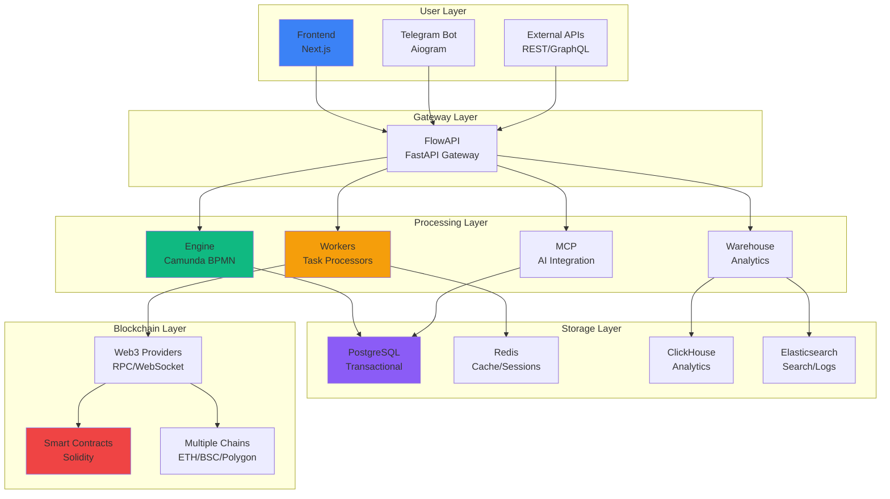
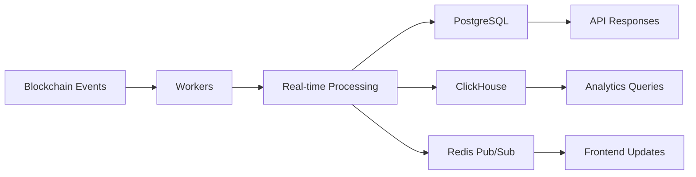

# Architecture Overview

The Guru Network Framework follows a **microservices architecture** pattern with clear separation of concerns. This design ensures scalability, maintainability, and fault tolerance while providing a unified experience for users.

## System Architecture

<div style={{minHeight: '600px', height: 'auto', margin: '20px 0', width: '100%', overflow: 'auto'}}>
<Frame>

</Frame>
</div>

## Design Principles

### 🎯 Separation of Concerns
Each service has a single, well-defined responsibility:

<CardGroup cols={2}>
  <Card title="Engine" icon="gear">
    **Workflow Orchestration**<br/>
    Manages BPMN workflows and process execution
  </Card>
  <Card title="FlowAPI" icon="gateway">
    **API Gateway**<br/>
    Handles authentication, routing, and coordination
  </Card>
  <Card title="Workers" icon="robot">
    **Task Processing**<br/>
    Executes blockchain operations and AI tasks
  </Card>
  <Card title="Warehouse" icon="database">
    **Data & Analytics**<br/>
    Aggregates data and provides analytics capabilities
  </Card>
</CardGroup>

### 🔄 Loose Coupling
Services communicate through well-defined interfaces and message queues, ensuring:

- **Independent Deployment**: Update services without affecting others
- **Technology Flexibility**: Use the best tool for each job
- **Fault Isolation**: Service failures don't cascade
- **Scalability**: Scale components based on actual load

### 🚀 Horizontal Scalability
Every component can scale independently:

<Tabs>
  <Tab title="Stateless Services">
    - **Frontend**: Multiple instances behind load balancer
    - **FlowAPI**: Horizontally scalable with session store
    - **Workers**: Auto-scaling based on queue depth
  </Tab>
  <Tab title="Stateful Services">
    - **Engine**: Clustered deployment with shared database
    - **Databases**: Read replicas and sharding support
    - **Cache**: Redis cluster with automatic failover
  </Tab>
</Tabs>

## Service Overview

### 🎮 Frontend (Next.js)
**Purpose**: Modern web interface for workflow management and monitoring

<AccordionGroup>
  <Accordion title="Key Features">
    - **Server-Side Rendering**: Optimized performance with SSR
    - **Real-time Updates**: WebSocket connections for live data
    - **Responsive Design**: Mobile-friendly interface
    - **Type Safety**: Full TypeScript implementation
  </Accordion>

  <Accordion title="Technical Stack">
    - **Framework**: Next.js 15 with App Router
    - **UI Library**: React 19 with hooks
    - **Styling**: Tailwind CSS with custom components
    - **State Management**: Zustand for client state
  </Accordion>
</AccordionGroup>

**Port**: 3000
**Dependencies**: FlowAPI, WebSocket connections

### 🚪 FlowAPI (FastAPI)
**Purpose**: Central API gateway and service coordinator

<AccordionGroup>
  <Accordion title="Core Responsibilities">
    - **Authentication**: JWT-based auth with refresh tokens
    - **Authorization**: Role-based access control (RBAC)
    - **Rate Limiting**: Prevent API abuse and ensure fair usage
    - **Request Routing**: Intelligent routing to backend services
  </Accordion>

  <Accordion title="API Capabilities">
    - **REST API**: Comprehensive RESTful endpoints
    - **WebSocket**: Real-time bidirectional communication
    - **GraphQL**: Flexible data querying (via Warehouse)
    - **OpenAPI**: Auto-generated documentation
  </Accordion>
</AccordionGroup>

**Port**: 8000
**Dependencies**: PostgreSQL, Redis, Engine, Warehouse

### ⚙️ Engine (Camunda)
**Purpose**: BPMN 2.0 workflow orchestration and process management

<AccordionGroup>
  <Accordion title="Workflow Features">
    - **BPMN 2.0 Compliance**: Full standard compliance
    - **External Tasks**: Distributed task execution
    - **Process Versioning**: Safe workflow updates
    - **Instance Management**: Complete lifecycle control
  </Accordion>

  <Accordion title="Enterprise Features">
    - **Cockpit UI**: Built-in monitoring dashboard
    - **History Service**: Complete audit trail
    - **DMN Engine**: Decision table support
    - **REST API**: Programmatic process control
  </Accordion>
</AccordionGroup>

**Port**: 8080
**Technology**: Java Spring Boot + Camunda Platform
**Dependencies**: PostgreSQL

### 🤖 Workers (Python)
**Purpose**: Distributed task processors for blockchain and AI operations

<Card title="Worker Types" icon="list">
  - **Blockchain Workers**: Transaction execution, contract interaction
  - **AI Workers**: Machine learning inference, NLP processing
  - **Data Workers**: ETL operations, external API calls
  - **DeFi Workers**: Trading strategies, liquidity management
</Card>

<AccordionGroup>
  <Accordion title="Blockchain Operations">
    - **Multi-Chain Support**: Ethereum, BSC, Polygon, Arbitrum
    - **Transaction Management**: Nonce handling, gas optimization
    - **Contract Interaction**: ABI encoding/decoding
    - **Event Monitoring**: Real-time blockchain event processing
  </Accordion>

  <Accordion title="AI Capabilities">
    - **Model Integration**: TensorFlow, PyTorch model serving
    - **NLP Processing**: Sentiment analysis, text classification
    - **Prediction Models**: Price prediction, risk assessment
    - **Decision Support**: Automated strategy optimization
  </Accordion>
</AccordionGroup>

**Technology**: Python with asyncio
**Dependencies**: Redis, blockchain RPCs, AI model APIs

### 📊 Warehouse (FastAPI + Analytics)
**Purpose**: Data aggregation, search, and analytics

<AccordionGroup>
  <Accordion title="Data Sources">
    - **Blockchain Events**: Smart contract events and transactions
    - **Market Data**: Price feeds from exchanges and oracles
    - **Social Data**: Social media sentiment and news
    - **Internal Metrics**: System performance and user activity
  </Accordion>

  <Accordion title="Analytics Capabilities">
    - **Real-time Processing**: Stream processing with sub-second latency
    - **Historical Analysis**: Years of historical data for backtesting
    - **Custom Metrics**: User-defined KPIs and dashboards
    - **Machine Learning**: Automated pattern recognition
  </Accordion>
</AccordionGroup>

**Port**: 8001
**Technology**: FastAPI + GraphQL
**Dependencies**: ClickHouse, Elasticsearch, PostgreSQL

### 💬 Bot (Telegram)
**Purpose**: Conversational interface for quick commands and notifications

<AccordionGroup>
  <Accordion title="Commands">
    - **Workflow Control**: Start, stop, monitor workflows
    - **Portfolio Status**: Real-time portfolio information
    - **Alerts**: Price alerts and system notifications
    - **Quick Actions**: Emergency stops and position management
  </Accordion>

  <Accordion title="Notifications">
    - **Trade Execution**: Successful trades and errors
    - **System Events**: Service health and maintenance
    - **Custom Alerts**: User-defined notification rules
    - **Performance Reports**: Daily/weekly summaries
  </Accordion>
</AccordionGroup>

**Technology**: Python Aiogram
**Dependencies**: FlowAPI, Telegram Bot API

### 🧠 MCP (AI Integration)
**Purpose**: AI model integration and context management

<AccordionGroup>
  <Accordion title="AI Models">
    - **Large Language Models**: GPT, Claude for decision making
    - **Specialized Models**: Trading-specific AI models
    - **Custom Models**: User-trained models for specific strategies
    - **Model Ensemble**: Combining multiple models for better accuracy
  </Accordion>

  <Accordion title="Memory Management">
    - **Short-term Memory**: Context for current conversations
    - **Long-term Memory**: Historical patterns and learnings
    - **Knowledge Base**: Domain-specific information storage
    - **Context Switching**: Maintain context across different tasks
  </Accordion>
</AccordionGroup>

**Technology**: Python + LangChain
**Dependencies**: AI model APIs, vector databases

## Communication Patterns

### 🔄 Synchronous Communication

<CardGroup cols={2}>
  <Card title="REST APIs" icon="exchange">
    **Use Case**: Direct service-to-service calls<br/>
    **Pattern**: Request-response with immediate feedback
  </Card>
  <Card title="GraphQL" icon="project-diagram">
    **Use Case**: Flexible data queries from frontend<br/>
    **Pattern**: Single endpoint with query optimization
  </Card>
</CardGroup>

### ⚡ Asynchronous Communication

<CardGroup cols={3}>
  <Card title="Message Queues" icon="list-check">
    **Technology**: RabbitMQ<br/>
    **Use Case**: Decoupled task processing
  </Card>
  <Card title="Event Streaming" icon="broadcast-tower">
    **Technology**: Redis Pub/Sub<br/>
    **Use Case**: Real-time notifications
  </Card>
  <Card title="External Tasks" icon="external-link">
    **Technology**: Camunda<br/>
    **Use Case**: Workflow task distribution
  </Card>
</CardGroup>

### 📡 Real-time Communication

<Info>
  WebSocket connections enable real-time updates for portfolio changes, trade executions, and system events.
</Info>

```javascript WebSocket Example
const ws = new WebSocket('wss://api.guru-network.io/ws');

ws.onmessage = (event) => {
  const data = JSON.parse(event.data);

  switch(data.type) {
    case 'portfolio_update':
      updatePortfolioDisplay(data.payload);
      break;
    case 'trade_execution':
      showTradeNotification(data.payload);
      break;
  }
};
```

## Data Architecture

### 🗄️ Database Strategy

<Tabs>
  <Tab title="PostgreSQL">
    **Primary Database**
    - User accounts and authentication
    - Workflow definitions and instances
    - Configuration and metadata
    - Financial transactions and balances
  </Tab>
  <Tab title="Redis">
    **Cache & Sessions**
    - Session storage and authentication tokens
    - Temporary data and computation results
    - Real-time data feeds and pub/sub
    - Rate limiting and API throttling
  </Tab>
  <Tab title="ClickHouse">
    **Time-Series Analytics**
    - Blockchain events and transactions
    - Market data and price feeds
    - Performance metrics and logs
    - Historical analysis and backtesting
  </Tab>
  <Tab title="Elasticsearch">
    **Search & Logging**
    - Full-text search capabilities
    - Log aggregation and analysis
    - Real-time event processing
    - Complex query and filtering
  </Tab>
</Tabs>

### 🔄 Data Flow

<div style={{minHeight: '500px', height: 'auto', margin: '20px 0', width: '100%', overflow: 'auto'}}>

</div>

## Security Architecture

### 🛡️ Defense in Depth

<Steps>
  <Step title="Network Security">
    - VPC isolation and security groups
    - TLS 1.3 for all communications
    - API rate limiting and DDoS protection
  </Step>
  <Step title="Application Security">
    - JWT authentication with short expiry
    - Role-based authorization (RBAC)
    - Input validation and sanitization
  </Step>
  <Step title="Data Security">
    - Encryption at rest (AES-256)
    - Private key protection with HSM
    - Secure secret management
  </Step>
  <Step title="Operational Security">
    - Comprehensive audit logging
    - Real-time security monitoring
    - Automated vulnerability scanning
  </Step>
</Steps>

<Warning>
  Private keys are never stored in plain text and are protected using Hardware Security Modules (HSMs) or secure enclaves.
</Warning>

## Scalability Considerations

### 📈 Horizontal Scaling

<CardGroup cols={2}>
  <Card title="Stateless Services" icon="expand">
    Can add more instances behind load balancers without coordination
  </Card>
  <Card title="Stateful Services" icon="database">
    Use clustering and replication for high availability
  </Card>
</CardGroup>

### ⚡ Performance Optimization

<AccordionGroup>
  <Accordion title="Database Optimization">
    - Read replicas for query distribution
    - Connection pooling and caching
    - Query optimization and indexing
    - Partitioning for large datasets
  </Accordion>

  <Accordion title="Caching Strategy">
    - Multi-level caching (Redis, CDN, browser)
    - Cache invalidation strategies
    - Precomputed results for common queries
    - Cache warming for critical data
  </Accordion>

  <Accordion title="API Optimization">
    - Response compression and minification
    - Request batching and multiplexing
    - Asynchronous processing where possible
    - GraphQL query optimization
  </Accordion>
</AccordionGroup>

## Next Steps

<CardGroup cols={2}>
  <Card title="System Design Deep Dive" icon="magnifying-glass" href="../architecture/system-design">
    Explore detailed component interactions and data flows
  </Card>
  <Card title="Core Components" icon="puzzle-piece" href="../components/engine">
    Learn about the framework's core components
  </Card>
</CardGroup>

<Note>
  This architecture supports thousands of concurrent users and processes millions of blockchain events daily. For specific scaling requirements, consult our [deployment guides](../deployment/docker).
</Note>