# System Design

This document provides an in-depth look at the Guru Network Framework's system design, component interactions, and architectural decisions.

## Component Architecture

The framework consists of core components that work together to provide BPMN workflow automation capabilities.

```mermaid
graph TB
    subgraph "🎮 User Interface"
        FE[Frontend<br/>Next.js 15 Telegram Mini App<br/>Port: 3000]
        ADMIN[Admin Dashboard<br/>FlowAPI Interface<br/>Separate Deployment]
    end

    subgraph "🔧 Core Processing"
        ENG[Camunda BPMN Engine<br/>Java/Spring Boot<br/>Port: 8080]
        WORK[External Workers<br/>Python Async<br/>Non-Custodial]
    end

    subgraph "⛓️ External Services"
        BC[Blockchain Networks<br/>Ethereum, BSC, Polygon]
        AI[AI Services<br/>OpenAI, Claude]
        APIs[External APIs<br/>CoinGecko, DEX APIs]
    end

    %% Core connections
    FE --> ENG
    ADMIN --> ENG
    ENG -.->|External Tasks| WORK

    %% External connections
    WORK --> BC
    WORK --> AI
    WORK --> APIs

    %% Styling
    classDef userInterface fill:#3B82F6,stroke:#1E40AF,color:#FFFFFF
    classDef coreProcessing fill:#F59E0B,stroke:#D97706,color:#FFFFFF
    classDef externalServices fill:#10B981,stroke:#047857,color:#FFFFFF

    class FE,ADMIN userInterface
    class ENG,WORK coreProcessing
    class BC,AI,APIs externalServices
```

<div style={{minHeight: '600px', height: 'auto', margin: '20px 0', width: '100%', overflow: 'auto'}}>
<Frame>

</Frame>
</div>

## Component Deep Dive

### 🎮 User Interface Layer

The user interface layer provides different access points for different user types:

<CardGroup cols={2}>
  <Card title="Frontend (Next.js)" icon="desktop">
    **Technology**: Next.js 15 with Telegram Mini Apps

    **Purpose**: Main user interface for workflow interaction

    **Key Features**:
    - Telegram Mini App integration
    - Real-time workflow status updates
    - Web3 wallet connections
    - Responsive design for mobile/desktop
  </Card>

  <Card title="Admin Dashboard (FlowAPI)" icon="dashboard">
    **Technology**: Flask-Admin with PostgreSQL

    **Purpose**: Administrative interface for system management

    **Key Features**:
    - User management and permissions
    - System monitoring and analytics
    - Configuration management
    - Workflow deployment tools
  </Card>
</CardGroup>

### 🔧 Core Processing Layer

The processing layer handles workflow orchestration and task execution:

<CardGroup cols={2}>
  <Card title="Camunda BPMN Engine" icon="cogs">
    **Technology**: Java/Spring Boot with embedded Tomcat

    **Purpose**: BPMN 2.0 workflow orchestration engine

    **Key Features**:
    - Visual workflow design support
    - Process instance management
    - External task delegation
    - Process monitoring and history

    **Deployment**:
    - Single container deployment
    - REST API for integration
    - Built-in Cockpit UI for monitoring
  </Card>

  <Card title="External Workers" icon="code">
    **Technology**: Python with async/await patterns

    **Purpose**: Non-custodial task processing

    **Key Features**:
    - Blockchain interaction capabilities
    - AI service integration
    - External API consumption
    - Scalable worker pool architecture

    **Security**:
    - No private key storage
    - User-controlled transaction signing
    - Stateless processing model
  </Card>
</CardGroup>

### ⛓️ External Service Integration

The framework integrates with various external services for extended functionality:

<AccordionGroup>
  <Accordion title="Blockchain Networks">
    **Supported Networks**:
    - Ethereum (ETH)
    - Binance Smart Chain (BSC)
    - Polygon (MATIC)
    - Additional EVM-compatible chains

    **Integration Pattern**:
    - RPC endpoint connections
    - Web3 provider abstraction
    - Multi-chain transaction support
    - Gas optimization strategies
  </Accordion>

  <Accordion title="AI Services">
    **Supported Providers**:
    - OpenAI (GPT models)
    - Anthropic (Claude)
    - Custom model endpoints

    **Use Cases**:
    - Natural language workflow triggers
    - Smart contract analysis
    - Market sentiment analysis
    - Automated decision making
  </Accordion>

  <Accordion title="External APIs">
    **Common Integrations**:
    - CoinGecko (price data)
    - DEX APIs (Uniswap, PancakeSwap)
    - Social media APIs
    - Notification services

    **Features**:
    - Rate limiting and retry logic
    - Response caching
    - Error handling and fallbacks
    - API key management
  </Accordion>
</AccordionGroup>

## Deployment Architecture

### 🐳 Docker Deployment

The main application uses a simple three-container setup:

```yaml
# docker-compose.yaml
version: '3.8'

services:
  engine:
    build: ./engine
    ports:
      - "8080:8080"
    environment:
      - INSCRIPTIONS_HISTORY_ENABLED=false
      - RABBITMQ_ENABLED=false

  gui:
    build: ./gui
    ports:
      - "3000:3000"

  external-workers:
    build: ./worker
    environment:
      - WORKER_SCRIPTS=messaging/telegram_message_worker.py,testnet_arbitrage/get_last_price.py
      - CAMUNDA_URL=http://engine:8080/engine-rest
      - CAMUNDA_USER=demo
      - CAMUNDA_PASSWORD=demo
    depends_on:
      - engine
```

### 📋 Separate Admin Deployment

The FlowAPI admin interface runs as a separate deployment with its own database:

```yaml
# flowapi/docker-compose.yml
services:
  admin:
    build: .
    ports:
      - "${ADMIN_PORT}:${ADMIN_PORT}"
    command: ["python", "./flow_api/__main__.py"]
    depends_on:
      - postgres
      - redis

  postgres:
    image: postgres:14-alpine
    environment:
      - POSTGRES_DB=${DB_NAME}
      - POSTGRES_USER=${DB_USER}
      - POSTGRES_PASSWORD=${DB_PASS}

  redis:
    image: redis:7-alpine
```

## Process Flow

### 🔄 Workflow Execution Flow

```mermaid
sequenceDiagram
    participant User as 👤 User
    participant FE as 🖥️ Frontend
    participant ENG as ⚙️ Engine
    participant WORK as 🔧 Worker
    participant EXT as 🌐 External Service

    User->>FE: Initiate Workflow
    FE->>ENG: Start Process Instance
    ENG->>ENG: Create External Task
    ENG->>WORK: Fetch and Lock Task
    WORK->>EXT: Execute Business Logic
    EXT-->>WORK: Return Result
    WORK->>ENG: Complete Task
    ENG->>FE: Process Completed
    FE->>User: Show Results
```

<div style={{minHeight: '500px', height: 'auto', margin: '20px 0', width: '100%', overflow: 'auto'}}>
<Frame>

</Frame>
</div>

### 🔐 Security Model

The framework implements a non-custodial security model:

<CardGroup cols={2}>
  <Card title="User Asset Security" icon="shield">
    - No private keys stored on servers
    - User-controlled transaction signing
    - MetaMask/WalletConnect integration
    - Approval-based transactions only
  </Card>

  <Card title="System Security" icon="lock">
    - Stateless worker processes
    - Environment-based configuration
    - Docker container isolation
    - Secure communication protocols
  </Card>
</CardGroup>

## Scalability Considerations

### 📈 Horizontal Scaling

The architecture supports horizontal scaling:

<AccordionGroup>
  <Accordion title="Worker Scaling">
    - **Multiple Worker Instances**: Deploy additional worker containers
    - **Task Distribution**: Camunda handles automatic task distribution
    - **Resource Isolation**: Each worker runs in isolated container
    - **Load Balancing**: Built-in task polling and locking mechanism
  </Accordion>

  <Accordion title="Engine Scaling">
    - **Clustering Support**: Camunda supports clustered deployments
    - **Database Sharing**: Multiple engine instances can share database
    - **Session Affinity**: Not required due to stateless design
    - **Load Distribution**: REST API endpoints can be load balanced
  </Accordion>
</AccordionGroup>

### 🔧 Monitoring and Observability

<CardGroup cols={2}>
  <Card title="Built-in Monitoring" icon="chart-line">
    **Camunda Cockpit**:
    - Process instance monitoring
    - Task execution history
    - Performance metrics
    - Error tracking and resolution
  </Card>

  <Card title="External Monitoring" icon="eye">
    **FlowAPI Dashboard**:
    - System health checks
    - User activity analytics
    - Resource utilization metrics
    - Custom reporting capabilities
  </Card>
</CardGroup>

## Development Patterns

### 🛠️ Worker Development

Workers follow a standardized pattern:

```python
from camunda.external_task.external_task import ExternalTask, TaskResult
from camunda.external_task.external_task_worker import ExternalTaskWorker

def handle_task(task: ExternalTask) -> TaskResult:
    """
    Process an external task from Camunda
    """
    try:
        # Get task variables
        input_data = task.get_variable("inputData")

        # Execute business logic
        result = process_business_logic(input_data)

        # Return success with output variables
        return task.complete({"result": result})

    except Exception as e:
        # Return failure with error details
        return task.failure(
            error_message=str(e),
            error_details="Error processing task",
            retries=3,
            retry_timeout=5000
        )

# Register worker with Camunda
worker = ExternalTaskWorker(
    worker_id="my-worker",
    base_url="http://engine:8080/engine-rest"
)
worker.subscribe("my-task-topic", handle_task)
```

### 🎯 Integration Best Practices

<CardGroup cols={2}>
  <Card title="Error Handling" icon="exclamation-triangle">
    - Implement proper retry mechanisms
    - Use circuit breakers for external services
    - Log errors with correlation IDs
    - Provide meaningful error messages
  </Card>

  <Card title="Performance" icon="gauge">
    - Cache frequently accessed data
    - Use connection pooling
    - Implement timeout mechanisms
    - Monitor resource usage
  </Card>
</CardGroup>

## Next Steps

<CardGroup cols={2}>
  <Card title="Component Details" icon="puzzle-piece" href="../components/engine">
    Explore detailed documentation for each component
  </Card>
  <Card title="Development Guide" icon="code" href="../development/environment">
    Learn how to develop and deploy custom workflows
  </Card>
</CardGroup>

<Note>
  This architecture prioritizes simplicity and security over complexity. The non-custodial design ensures user asset safety while maintaining operational efficiency.
</Note>