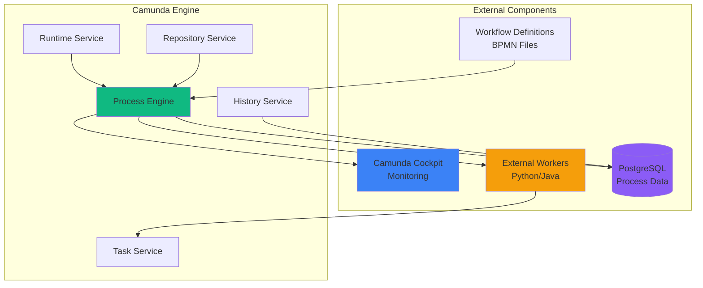

# Engine (Camunda BPMN)

The Engine is the heart of the Guru Framework, orchestrating complex business processes using the industry-standard BPMN 2.0 specification powered by Camunda Platform.

## Overview

<CardGroup cols={2}>
  <Card title="BPMN 2.0 Compliant" icon="diagram-project">
    Full compliance with Business Process Model and Notation standard
  </Card>
  <Card title="External Tasks" icon="arrow-right-from-bracket">
    Distributed task execution across multiple worker instances
  </Card>
  <Card title="Process Versioning" icon="code-branch">
    Safe deployment and migration of workflow versions
  </Card>
  <Card title="Enterprise Features" icon="building">
    Built-in monitoring, audit trails, and management tools
  </Card>
</CardGroup>

## Architecture

<div style={{minHeight: '600px', height: 'auto', margin: '20px 0', width: '100%', overflow: 'auto'}}>
<Frame>

</Frame>
</div>

## Core Features

### 🔄 Process Management

<AccordionGroup>
  <Accordion title="Process Deployment">
    Deploy BPMN workflows dynamically without downtime:

    ```java
    @Service
    public class WorkflowDeploymentService {

        @Autowired
        private RepositoryService repositoryService;

        public DeploymentResult deployWorkflow(String bpmnContent, String name) {
            Deployment deployment = repositoryService
                .createDeployment()
                .name(name)
                .addString(name + ".bpmn", bpmnContent)
                .enableDuplicateFiltering(true)
                .deploy();

            return new DeploymentResult(deployment.getId(), deployment.getName());
        }

        public List<ProcessDefinition> getActiveProcesses() {
            return repositoryService
                .createProcessDefinitionQuery()
                .active()
                .latestVersion()
                .list();
        }
    }
    ```
  </Accordion>

  <Accordion title="Process Instance Management">
    Control workflow execution lifecycle:

    ```java
    @RestController
    @RequestMapping("/api/processes")
    public class ProcessController {

        @Autowired
        private RuntimeService runtimeService;

        @PostMapping("/{processKey}/start")
        public ProcessInstanceResponse startProcess(
            @PathVariable String processKey,
            @RequestBody Map<String, Object> variables
        ) {
            ProcessInstance instance = runtimeService
                .startProcessInstanceByKey(processKey, variables);

            return new ProcessInstanceResponse(
                instance.getId(),
                instance.getProcessDefinitionKey(),
                "ACTIVE"
            );
        }

        @PostMapping("/{instanceId}/signal")
        public void signalProcess(
            @PathVariable String instanceId,
            @RequestParam String signalName
        ) {
            runtimeService.signalEventReceived(signalName, instanceId);
        }
    }
    ```
  </Accordion>

  <Accordion title="Variable Management">
    Type-safe variable handling across process instances:

    ```java
    public class ProcessVariableManager {

        public void setVariables(String processInstanceId, Map<String, Object> variables) {
            // Validate and transform variables
            Map<String, Object> validatedVars = validateVariables(variables);

            runtimeService.setVariables(processInstanceId, validatedVars);
        }

        public <T> T getVariable(String processInstanceId, String name, Class<T> type) {
            Object value = runtimeService.getVariable(processInstanceId, name);
            return type.cast(value);
        }

        private Map<String, Object> validateVariables(Map<String, Object> variables) {
            return variables.entrySet().stream()
                .filter(entry -> isValidVariable(entry))
                .collect(Collectors.toMap(
                    Map.Entry::getKey,
                    entry -> sanitizeValue(entry.getValue())
                ));
        }
    }
    ```
  </Accordion>
</AccordionGroup>

### 🔗 External Task Pattern

The Engine uses the External Task pattern for distributed processing:

<Steps>
  <Step title="Task Creation">
    Engine creates external tasks when reaching service tasks in BPMN
  </Step>
  <Step title="Worker Polling">
    External workers poll for available tasks matching their topics
  </Step>
  <Step title="Task Execution">
    Workers execute business logic and complete or fail tasks
  </Step>
  <Step title="Process Continuation">
    Engine continues workflow execution based on task results
  </Step>
</Steps>

#### BPMN Service Task Configuration

```xml
<bpmn:serviceTask id="execute-trade"
                  name="Execute Trading Strategy"
                  camunda:type="external"
                  camunda:topic="trading-execution">

  <bpmn:extensionElements>
    <camunda:inputOutput>
      <camunda:inputParameter name="symbol">${symbol}</camunda:inputParameter>
      <camunda:inputParameter name="amount">${amount}</camunda:inputParameter>
      <camunda:inputParameter name="strategy">${strategy}</camunda:inputParameter>

      <camunda:outputParameter name="tradeResult">${tradeResult}</camunda:outputParameter>
      <camunda:outputParameter name="executionTime">${executionTime}</camunda:outputParameter>
    </camunda:inputOutput>

    <camunda:properties>
      <camunda:property name="priority" value="100" />
      <camunda:property name="retries" value="3" />
    </camunda:properties>
  </bpmn:extensionElements>

</bpmn:serviceTask>
```

#### External Task Handler

```java
@Component
public class TradingExecutionHandler {

    @ExternalTaskSubscription(
        value = "trading-execution",
        lockDuration = 60000,  // 1 minute
        processDefinitionKey = "trading-workflow"
    )
    public void handleTradingTask(ExternalTask externalTask, ExternalTaskService externalTaskService) {

        try {
            // Extract input parameters
            String symbol = externalTask.getVariable("symbol");
            BigDecimal amount = externalTask.getVariable("amount");
            String strategy = externalTask.getVariable("strategy");

            // Execute trading logic
            TradeResult result = tradingService.executeTrade(symbol, amount, strategy);

            // Prepare output variables
            Map<String, Object> variables = new HashMap<>();
            variables.put("tradeResult", result);
            variables.put("executionTime", System.currentTimeMillis());
            variables.put("tradeId", result.getTradeId());

            // Complete task
            externalTaskService.complete(externalTask, variables);

            log.info("Trading task completed successfully: {}", result.getTradeId());

        } catch (InsufficientFundsException e) {
            // Business error - complete with error flag
            Map<String, Object> variables = new HashMap<>();
            variables.put("tradeResult", "INSUFFICIENT_FUNDS");
            variables.put("errorMessage", e.getMessage());

            externalTaskService.complete(externalTask, variables);

        } catch (Exception e) {
            // Technical error - retry
            externalTaskService.handleFailure(
                externalTask,
                "Trading execution failed",
                e.getMessage(),
                externalTask.getRetries() - 1,
                5000  // Retry after 5 seconds
            );

            log.error("Trading task failed: {}", e.getMessage(), e);
        }
    }
}
```

## Configuration

### 🔧 Application Configuration

<Tabs>
  <Tab title="application.yml">
    ```yaml
    server:
      port: 8080

    spring:
      datasource:
        url: ${DATABASE_URL:jdbc:postgresql://localhost:5432/guru_db}
        username: ${DB_USERNAME:guru}
        password: ${DB_PASSWORD:password}
        driver-class-name: org.postgresql.Driver

      jpa:
        hibernate:
          ddl-auto: validate
        show-sql: false
        properties:
          hibernate:
            dialect: org.hibernate.dialect.PostgreSQLDialect

    camunda:
      bpm:
        admin-user:
          id: ${CAMUNDA_ADMIN_USER:admin}
          password: ${CAMUNDA_ADMIN_PASSWORD:admin}
          firstName: Admin
          email: admin@guru-network.io

        deployment:
          resource-pattern: classpath:processes/*.bpmn

        job-execution:
          enabled: true
          max-jobs-per-acquisition: 10
          wait-time-in-millis: 5000

        metrics:
          enabled: true
          db-reporter-activate: true

        generic-properties:
          properties:
            historyLevel: ACTIVITY
            jobExecutorActivate: true
            defaultSerializationFormat: application/json

    logging:
      level:
        org.camunda: INFO
        com.guru.engine: DEBUG
      pattern:
        file: "%d{yyyy-MM-dd HH:mm:ss} [%thread] %-5level %logger{36} - %msg%n"
    ```
  </Tab>
  <Tab title="Docker Configuration">
    ```dockerfile
    FROM openjdk:17-jdk-slim

    # Install dependencies
    RUN apt-get update && apt-get install -y \
        curl \
        postgresql-client \
        && rm -rf /var/lib/apt/lists/*

    # Create app directory
    WORKDIR /app

    # Copy built JAR
    COPY build/libs/guru-engine-*.jar app.jar

    # Copy process definitions
    COPY src/main/resources/processes/ /app/processes/

    # Health check
    HEALTHCHECK --interval=30s --timeout=3s --start-period=5s --retries=3 \
        CMD curl -f http://localhost:8080/actuator/health || exit 1

    # Run application
    EXPOSE 8080
    ENTRYPOINT ["java", "-jar", "app.jar"]
    ```
  </Tab>
</Tabs>

### ⚙️ Process Engine Configuration

```java
@Configuration
@EnableProcessApplication
public class ProcessEngineConfiguration {

    @Bean
    public ProcessEngineConfigurationImpl processEngineConfiguration(
        DataSource dataSource,
        TransactionManager transactionManager
    ) {
        SpringProcessEngineConfiguration config = new SpringProcessEngineConfiguration();

        config.setDataSource(dataSource);
        config.setTransactionManager(transactionManager);
        config.setDatabaseSchemaUpdate(ProcessEngineConfiguration.DB_SCHEMA_UPDATE_FALSE);

        // History configuration
        config.setHistory(ProcessEngineConfiguration.HISTORY_ACTIVITY);

        // Job executor configuration
        config.setJobExecutorActivate(true);
        config.setJobExecutorDeploymentAware(true);

        // Metrics configuration
        config.setMetricsEnabled(true);
        config.setDbMetricsReporterActivate(true);

        // External task configuration
        config.setDefaultNumberOfRetries(3);

        return config;
    }

    @Bean
    public SpringProcessApplication processApplication() {
        return new SpringProcessApplication();
    }
}
```

## Monitoring & Management

### 📊 Camunda Cockpit

Access the built-in monitoring interface at `http://localhost:8080/camunda`:

<CardGroup cols={2}>
  <Card title="Process Monitoring" icon="chart-line">
    - Real-time process instance tracking
    - Activity timeline and duration analysis
    - Variable inspection and modification
    - Incident management and resolution
  </Card>
  <Card title="Deployment Management" icon="upload">
    - Process definition versioning
    - Hot deployment capabilities
    - Rollback and migration tools
    - Resource management
  </Card>
</CardGroup>

### 📈 Metrics and Analytics

```java
@Component
public class ProcessMetricsCollector {

    @Autowired
    private ManagementService managementService;

    @Scheduled(fixedRate = 60000) // Every minute
    public void collectMetrics() {
        // Process instance metrics
        long activeInstances = managementService
            .createMetricsQuery()
            .name(Metrics.PROCESS_INSTANCES)
            .sum();

        // Job metrics
        long jobsExecuted = managementService
            .createMetricsQuery()
            .name(Metrics.JOB_SUCCESSFUL)
            .sum();

        long jobsFailed = managementService
            .createMetricsQuery()
            .name(Metrics.JOB_FAILED)
            .sum();

        // External task metrics
        long externalTasksCompleted = managementService
            .createMetricsQuery()
            .name("external-tasks-completed")
            .sum();

        // Send to monitoring system
        metricsService.recordGauge("camunda.instances.active", activeInstances);
        metricsService.recordGauge("camunda.jobs.executed", jobsExecuted);
        metricsService.recordGauge("camunda.jobs.failed", jobsFailed);
        metricsService.recordGauge("camunda.external_tasks.completed", externalTasksCompleted);
    }
}
```

### 🚨 Health Checks

```java
@Component
public class ProcessEngineHealthIndicator implements HealthIndicator {

    @Autowired
    private ProcessEngine processEngine;

    @Override
    public Health health() {
        try {
            // Check database connection
            processEngine.getManagementService()
                .getTableCount()
                .get("ACT_RU_EXECUTION");

            // Check job executor
            boolean jobExecutorActive = processEngine
                .getProcessEngineConfiguration()
                .getJobExecutor()
                .isActive();

            return Health.up()
                .withDetail("database", "UP")
                .withDetail("jobExecutor", jobExecutorActive ? "UP" : "DOWN")
                .withDetail("version", ProcessEngine.VERSION)
                .build();

        } catch (Exception e) {
            return Health.down()
                .withDetail("error", e.getMessage())
                .build();
        }
    }
}
```

## Best Practices

### 🎯 Workflow Design

<AccordionGroup>
  <Accordion title="Service Task Patterns">
    - **Idempotent Operations**: Design tasks to be safely retryable
    - **Timeout Handling**: Set appropriate lock durations for external tasks
    - **Error Handling**: Distinguish between business and technical errors
    - **Variable Scope**: Minimize variable payload size and complexity
  </Accordion>

  <Accordion title="Process Modeling">
    - **Atomic Activities**: Keep service tasks focused on single responsibilities
    - **Clear Naming**: Use descriptive names for tasks and gateways
    - **Error Boundaries**: Model expected error scenarios explicitly
    - **Async Patterns**: Use external tasks for long-running operations
  </Accordion>

  <Accordion title="Performance Optimization">
    - **Batch Processing**: Group related operations in single tasks
    - **Lazy Loading**: Avoid loading unnecessary process variables
    - **Index Usage**: Ensure proper database indexing for queries
    - **Connection Pooling**: Configure appropriate connection pool sizes
  </Accordion>
</AccordionGroup>

### 🔒 Security Considerations

<CardGroup cols={2}>
  <Card title="Access Control" icon="shield-check">
    - Implement proper authentication for Camunda Cockpit
    - Use role-based authorization for process operations
    - Secure external task endpoints
    - Validate all input parameters
  </Card>
  <Card title="Data Protection" icon="lock">
    - Encrypt sensitive process variables
    - Implement audit logging for all operations
    - Use secure communication channels
    - Regular security assessments
  </Card>
</CardGroup>

## Troubleshooting

### 🔍 Common Issues

<AccordionGroup>
  <Accordion title="Process Instance Stuck">
    **Symptoms**: Process instances not progressing through workflow

    **Diagnosis**:
    ```sql
    -- Check for incidents
    SELECT * FROM ACT_RU_INCIDENT WHERE PROC_INST_ID_ = 'your-instance-id';

    -- Check external tasks
    SELECT * FROM ACT_RU_EXT_TASK WHERE PROC_INST_ID_ = 'your-instance-id';

    -- Check jobs
    SELECT * FROM ACT_RU_JOB WHERE PROCESS_INSTANCE_ID_ = 'your-instance-id';
    ```

    **Solutions**:
    - Check external worker logs for errors
    - Verify worker topic subscription matches BPMN
    - Restart failed jobs manually if needed
    - Review process variables for corruption
  </Accordion>

  <Accordion title="High Memory Usage">
    **Symptoms**: OutOfMemoryError or high heap usage

    **Solutions**:
    ```java
    // Optimize process variable handling
    public void setLargeVariable(String processInstanceId, byte[] data) {
        // Use file variables for large data
        FileValue fileValue = Variables
            .fileValue("large-data.json")
            .file(data)
            .mimeType("application/json")
            .create();

        runtimeService.setVariable(processInstanceId, "largeData", fileValue);
    }

    // Cleanup completed instances
    @Scheduled(cron = "0 0 2 * * ?") // Daily at 2 AM
    public void cleanupHistory() {
        Date cutoff = Date.from(Instant.now().minus(30, ChronoUnit.DAYS));

        historyService.createHistoricProcessInstanceQuery()
            .finishedBefore(cutoff)
            .list()
            .forEach(instance ->
                historyService.deleteHistoricProcessInstance(instance.getId())
            );
    }
    ```
  </Accordion>
</AccordionGroup>

## Next Steps

<CardGroup cols={2}>
  <Card title="FlowAPI Component" icon="server" href="../components/flowapi">
    Learn about the API gateway and service interface
  </Card>
  <Card title="Workers Component" icon="robot" href="../components/workers">
    Understand distributed task processing with workers
  </Card>
</CardGroup>

<Note>
  The Engine component is critical for workflow orchestration. For production deployments, ensure proper database backup strategies and monitoring are in place.
</Note>