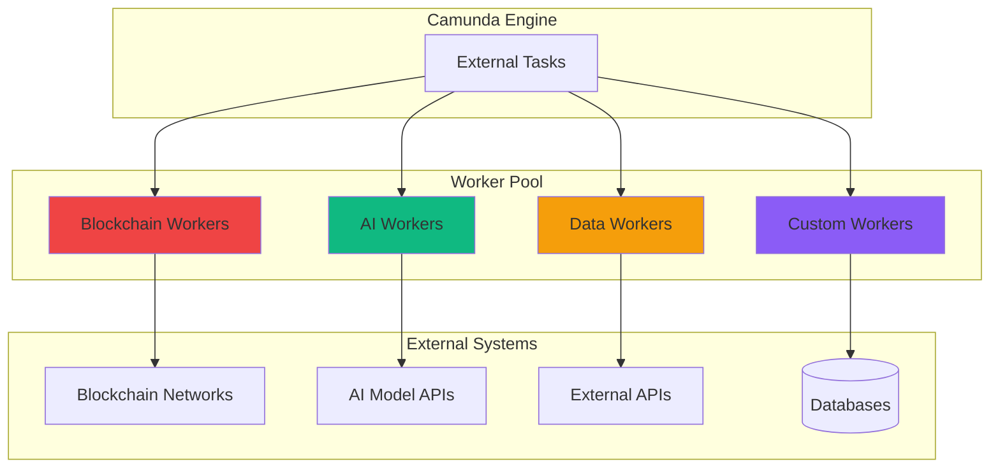

# Workers (Task Processors)

Workers are distributed task processors that handle blockchain operations, AI tasks, and data processing in the Guru Framework. They use the External Task pattern to communicate with the Camunda Engine.

## Overview

<CardGroup cols={2}>
  <Card title="Distributed Processing" icon="network-wired">
    Scale horizontally by adding more worker instances
  </Card>
  <Card title="Blockchain Operations" icon="link">
    Execute transactions across multiple blockchain networks
  </Card>
  <Card title="AI Integration" icon="brain">
    Run machine learning models and AI processing tasks
  </Card>
  <Card title="Fault Tolerance" icon="shield-check">
    Built-in retry mechanisms and error handling
  </Card>
</CardGroup>

## Architecture

<div style={{minHeight: '600px', height: 'auto', margin: '20px 0', width: '100%', overflow: 'auto'}}>
<Frame>

</Frame>
</div>

## Worker Types

### 🔗 Blockchain Workers

Handle cryptocurrency transactions and smart contract interactions.

<AccordionGroup>
  <Accordion title="Ethereum Transaction Worker">
    ```python
    from guru_worker.base import ExternalTaskWorker
    from web3 import Web3
    from decimal import Decimal
    import asyncio

    class EthereumTransactionWorker(ExternalTaskWorker):
        topic = "ethereum-transaction"
        max_retries = 3
        retry_timeout = 5000  # 5 seconds

        def __init__(self):
            super().__init__()
            self.w3 = Web3(Web3.HTTPProvider(settings.ETHEREUM_RPC_URL))
            self.account = self.w3.eth.account.from_key(settings.PRIVATE_KEY)

        async def handle(self, task: ExternalTask, service: ExternalTaskService):
            try:
                # Extract parameters from task
                to_address = task.variables.get("to_address")
                amount_eth = Decimal(task.variables.get("amount"))
                gas_limit = task.variables.get("gas_limit", 21000)

                # Build transaction
                transaction = {
                    'from': self.account.address,
                    'to': to_address,
                    'value': self.w3.to_wei(amount_eth, 'ether'),
                    'gas': gas_limit,
                    'gasPrice': await self._get_gas_price(),
                    'nonce': await self._get_nonce(),
                }

                # Estimate gas if not provided
                if gas_limit == 21000:
                    transaction['gas'] = await self.w3.eth.estimate_gas(transaction)

                # Sign transaction
                signed_txn = self.account.sign_transaction(transaction)

                # Send transaction
                tx_hash = await self.w3.eth.send_raw_transaction(
                    signed_txn.rawTransaction
                )

                # Wait for confirmation
                receipt = await self.w3.eth.wait_for_transaction_receipt(
                    tx_hash, timeout=300
                )

                # Complete task with results
                await service.complete(task.id, {
                    "transaction_hash": receipt.transactionHash.hex(),
                    "block_number": receipt.blockNumber,
                    "gas_used": receipt.gasUsed,
                    "status": "success" if receipt.status == 1 else "failed",
                    "effective_gas_price": receipt.effectiveGasPrice
                })

                self.logger.info(f"Transaction completed: {tx_hash.hex()}")

            except Exception as e:
                await service.fail(
                    task.id,
                    error_message=f"Transaction failed: {str(e)}",
                    retries=task.retries - 1
                )
                self.logger.error(f"Transaction failed: {e}")

        async def _get_gas_price(self):
            """Get current gas price with safety buffer"""
            current_price = await self.w3.eth.gas_price
            return int(current_price * 1.1)  # 10% buffer

        async def _get_nonce(self):
            """Get next nonce for account"""
            return await self.w3.eth.get_transaction_count(
                self.account.address, 'pending'
            )
    ```
  </Accordion>

  <Accordion title="DEX Trading Worker">
    ```python
    class DEXTradingWorker(ExternalTaskWorker):
        topic = "dex-trading"

        def __init__(self):
            super().__init__()
            self.uniswap = UniswapV3Router(settings.UNISWAP_ROUTER_ADDRESS)
            self.w3 = Web3(Web3.HTTPProvider(settings.ETHEREUM_RPC_URL))

        async def handle(self, task: ExternalTask, service: ExternalTaskService):
            try:
                # Extract trading parameters
                token_in = task.variables.get("token_in")
                token_out = task.variables.get("token_out")
                amount_in = Decimal(task.variables.get("amount_in"))
                min_amount_out = Decimal(task.variables.get("min_amount_out"))
                slippage = Decimal(task.variables.get("slippage", "0.5"))

                # Check current prices
                current_price = await self._get_price(token_in, token_out)
                expected_out = amount_in * current_price

                # Apply slippage protection
                min_out_with_slippage = expected_out * (1 - slippage / 100)

                if min_out_with_slippage < min_amount_out:
                    raise ValueError("Price moved beyond slippage tolerance")

                # Execute swap
                swap_result = await self.uniswap.exact_input_single({
                    'tokenIn': token_in,
                    'tokenOut': token_out,
                    'fee': 3000,  # 0.3%
                    'recipient': self.account.address,
                    'deadline': int(time.time()) + 300,  # 5 minutes
                    'amountIn': self.w3.to_wei(amount_in, 'ether'),
                    'amountOutMinimum': self.w3.to_wei(min_out_with_slippage, 'ether'),
                    'sqrtPriceLimitX96': 0
                })

                await service.complete(task.id, {
                    "swap_hash": swap_result.hash.hex(),
                    "amount_out": str(swap_result.amount_out),
                    "price_impact": str(swap_result.price_impact),
                    "gas_used": swap_result.gas_used
                })

            except Exception as e:
                await service.fail(task.id, str(e), task.retries - 1)

        async def _get_price(self, token_in: str, token_out: str) -> Decimal:
            """Get current exchange rate between tokens"""
            # Implementation depends on price oracle or DEX quoter
            pass
    ```
  </Accordion>
</AccordionGroup>

### 🧠 AI Workers

Execute machine learning models and AI processing tasks.

<AccordionGroup>
  <Accordion title="Trading Signal Worker">
    ```python
    import numpy as np
    import tensorflow as tf
    from guru_worker.base import ExternalTaskWorker

    class TradingSignalWorker(ExternalTaskWorker):
        topic = "generate-trading-signal"

        def __init__(self):
            super().__init__()
            self.model = tf.keras.models.load_model('models/trading_lstm_v2.h5')
            self.scaler = joblib.load('models/price_scaler.pkl')
            self.feature_columns = ['open', 'high', 'low', 'close', 'volume',
                                  'rsi', 'macd', 'bb_upper', 'bb_lower']

        async def handle(self, task: ExternalTask, service: ExternalTaskService):
            try:
                symbol = task.variables.get("symbol")
                timeframe = task.variables.get("timeframe", "1h")
                lookback_periods = task.variables.get("lookback_periods", 100)

                # Fetch market data
                market_data = await self._fetch_market_data(
                    symbol, timeframe, lookback_periods
                )

                # Calculate technical indicators
                features = self._calculate_features(market_data)

                # Prepare data for model
                X = self._prepare_model_input(features)

                # Generate prediction
                prediction = self.model.predict(X)
                signal, confidence = self._interpret_prediction(prediction)

                # Calculate additional metrics
                volatility = self._calculate_volatility(market_data)
                trend_strength = self._calculate_trend_strength(features)

                await service.complete(task.id, {
                    "signal": signal,  # "BUY", "SELL", "HOLD"
                    "confidence": float(confidence),
                    "volatility": float(volatility),
                    "trend_strength": float(trend_strength),
                    "timestamp": int(time.time()),
                    "model_version": "v2.1"
                })

            except Exception as e:
                await service.fail(task.id, str(e), task.retries - 1)

        def _calculate_features(self, data: pd.DataFrame) -> pd.DataFrame:
            """Calculate technical indicators"""
            # RSI
            data['rsi'] = ta.momentum.rsi(data['close'])

            # MACD
            macd = ta.trend.MACD(data['close'])
            data['macd'] = macd.macd()

            # Bollinger Bands
            bb = ta.volatility.BollingerBands(data['close'])
            data['bb_upper'] = bb.bollinger_hband()
            data['bb_lower'] = bb.bollinger_lband()

            return data[self.feature_columns].dropna()

        def _prepare_model_input(self, features: pd.DataFrame) -> np.ndarray:
            """Prepare features for LSTM model"""
            # Scale features
            scaled_features = self.scaler.transform(features)

            # Create sequences for LSTM
            sequence_length = 60
            X = []
            for i in range(sequence_length, len(scaled_features)):
                X.append(scaled_features[i-sequence_length:i])

            return np.array(X)

        def _interpret_prediction(self, prediction: np.ndarray) -> tuple:
            """Convert model output to trading signal"""
            # Assuming model outputs probabilities for [BUY, HOLD, SELL]
            prob_buy, prob_hold, prob_sell = prediction[0]

            max_prob = max(prob_buy, prob_hold, prob_sell)

            if prob_buy == max_prob and prob_buy > 0.6:
                return "BUY", prob_buy
            elif prob_sell == max_prob and prob_sell > 0.6:
                return "SELL", prob_sell
            else:
                return "HOLD", prob_hold
    ```
  </Accordion>

  <Accordion title="Risk Assessment Worker">
    ```python
    class RiskAssessmentWorker(ExternalTaskWorker):
        topic = "risk-assessment"

        async def handle(self, task: ExternalTask, service: ExternalTaskService):
            try:
                portfolio = task.variables.get("portfolio")
                position_size = Decimal(task.variables.get("position_size"))
                symbol = task.variables.get("symbol")

                # Calculate Value at Risk (VaR)
                var_95 = await self._calculate_var(portfolio, symbol, position_size)

                # Calculate portfolio correlation
                correlation_score = await self._calculate_correlation(portfolio, symbol)

                # Assess concentration risk
                concentration_risk = self._assess_concentration_risk(portfolio, symbol, position_size)

                # Calculate Sharpe ratio impact
                sharpe_impact = await self._calculate_sharpe_impact(portfolio, symbol, position_size)

                # Overall risk score (0-100)
                risk_score = self._calculate_overall_risk_score(
                    var_95, correlation_score, concentration_risk, sharpe_impact
                )

                await service.complete(task.id, {
                    "risk_score": float(risk_score),
                    "var_95": float(var_95),
                    "correlation_score": float(correlation_score),
                    "concentration_risk": float(concentration_risk),
                    "sharpe_impact": float(sharpe_impact),
                    "recommendation": self._get_risk_recommendation(risk_score)
                })

            except Exception as e:
                await service.fail(task.id, str(e), task.retries - 1)

        async def _calculate_var(self, portfolio: dict, symbol: str, position_size: Decimal) -> Decimal:
            """Calculate 95% Value at Risk"""
            # Historical simulation method
            historical_returns = await self._get_historical_returns(symbol, days=252)
            return np.percentile(historical_returns, 5) * position_size

        def _get_risk_recommendation(self, risk_score: float) -> str:
            """Provide risk-based recommendation"""
            if risk_score < 30:
                return "LOW_RISK_PROCEED"
            elif risk_score < 70:
                return "MEDIUM_RISK_CAUTION"
            else:
                return "HIGH_RISK_REJECT"
    ```
  </Accordion>
</AccordionGroup>

### 📊 Data Workers

Handle data processing, ETL operations, and external API integrations.

<AccordionGroup>
  <Accordion title="Market Data Collector">
    ```python
    class MarketDataCollectorWorker(ExternalTaskWorker):
        topic = "collect-market-data"

        def __init__(self):
            super().__init__()
            self.exchanges = {
                'binance': BinanceAPI(),
                'coinbase': CoinbaseAPI(),
                'kraken': KrakenAPI()
            }

        async def handle(self, task: ExternalTask, service: ExternalTaskService):
            try:
                symbols = task.variables.get("symbols", [])
                timeframe = task.variables.get("timeframe", "1h")
                exchanges = task.variables.get("exchanges", ["binance", "coinbase"])

                collected_data = {}

                for exchange_name in exchanges:
                    if exchange_name not in self.exchanges:
                        continue

                    exchange = self.exchanges[exchange_name]

                    for symbol in symbols:
                        try:
                            data = await exchange.get_ohlcv(symbol, timeframe, limit=100)

                            collected_data[f"{exchange_name}_{symbol}"] = {
                                "data": data,
                                "timestamp": int(time.time()),
                                "source": exchange_name
                            }

                        except Exception as e:
                            self.logger.warning(f"Failed to collect {symbol} from {exchange_name}: {e}")

                # Store data in warehouse
                await self._store_market_data(collected_data)

                await service.complete(task.id, {
                    "symbols_collected": len(collected_data),
                    "timestamp": int(time.time()),
                    "status": "success"
                })

            except Exception as e:
                await service.fail(task.id, str(e), task.retries - 1)

        async def _store_market_data(self, data: dict):
            """Store collected data in ClickHouse"""
            async with get_clickhouse_client() as client:
                for key, value in data.items():
                    await client.execute(
                        "INSERT INTO market_data VALUES",
                        value["data"]
                    )
    ```
  </Accordion>

  <Accordion title="News Sentiment Worker">
    ```python
    from transformers import pipeline

    class NewsSentimentWorker(ExternalTaskWorker):
        topic = "analyze-news-sentiment"

        def __init__(self):
            super().__init__()
            self.sentiment_analyzer = pipeline(
                "sentiment-analysis",
                model="ProsusAI/finbert"
            )

        async def handle(self, task: ExternalTask, service: ExternalTaskService):
            try:
                news_articles = task.variables.get("news_articles", [])
                symbol = task.variables.get("symbol")

                sentiment_scores = []

                for article in news_articles:
                    # Analyze sentiment
                    result = self.sentiment_analyzer(article["content"])

                    sentiment_scores.append({
                        "title": article["title"],
                        "sentiment": result[0]["label"],
                        "confidence": result[0]["score"],
                        "timestamp": article["timestamp"]
                    })

                # Calculate overall sentiment
                overall_sentiment = self._calculate_overall_sentiment(sentiment_scores)

                await service.complete(task.id, {
                    "overall_sentiment": overall_sentiment,
                    "individual_scores": sentiment_scores,
                    "article_count": len(news_articles),
                    "analysis_timestamp": int(time.time())
                })

            except Exception as e:
                await service.fail(task.id, str(e), task.retries - 1)

        def _calculate_overall_sentiment(self, scores: list) -> dict:
            """Calculate weighted average sentiment"""
            if not scores:
                return {"sentiment": "NEUTRAL", "confidence": 0.5}

            positive_weight = sum(s["confidence"] for s in scores if s["sentiment"] == "POSITIVE")
            negative_weight = sum(s["confidence"] for s in scores if s["sentiment"] == "NEGATIVE")
            neutral_weight = sum(s["confidence"] for s in scores if s["sentiment"] == "NEUTRAL")

            total_weight = positive_weight + negative_weight + neutral_weight

            if total_weight == 0:
                return {"sentiment": "NEUTRAL", "confidence": 0.5}

            if positive_weight > negative_weight and positive_weight > neutral_weight:
                return {"sentiment": "POSITIVE", "confidence": positive_weight / total_weight}
            elif negative_weight > positive_weight and negative_weight > neutral_weight:
                return {"sentiment": "NEGATIVE", "confidence": negative_weight / total_weight}
            else:
                return {"sentiment": "NEUTRAL", "confidence": neutral_weight / total_weight}
    ```
  </Accordion>
</AccordionGroup>

## Worker Base Class

### 🏗️ Base Worker Implementation

```python
import asyncio
import logging
from abc import ABC, abstractmethod
from typing import Dict, Any, Optional
from dataclasses import dataclass

@dataclass
class ExternalTask:
    id: str
    topic: str
    variables: Dict[str, Any]
    retries: int
    worker_id: str
    activity_id: str
    process_instance_id: str

class ExternalTaskService:
    async def complete(self, task_id: str, variables: Dict[str, Any] = None):
        """Complete an external task"""
        pass

    async def fail(self, task_id: str, error_message: str, retries: int = 0):
        """Fail an external task"""
        pass

    async def extend_lock(self, task_id: str, duration: int):
        """Extend task lock duration"""
        pass

class ExternalTaskWorker(ABC):
    def __init__(self):
        self.logger = logging.getLogger(self.__class__.__name__)
        self.topic = getattr(self, 'topic', None)
        self.max_retries = getattr(self, 'max_retries', 3)
        self.retry_timeout = getattr(self, 'retry_timeout', 5000)
        self.lock_duration = getattr(self, 'lock_duration', 60000)

    @abstractmethod
    async def handle(self, task: ExternalTask, service: ExternalTaskService):
        """Handle the external task - must be implemented by subclasses"""
        pass

    async def on_failure(self, task: ExternalTask, error: Exception):
        """Called when task handling fails - can be overridden"""
        self.logger.error(f"Task {task.id} failed: {error}")

    async def on_success(self, task: ExternalTask, result: Dict[str, Any]):
        """Called when task completes successfully - can be overridden"""
        self.logger.info(f"Task {task.id} completed successfully")

class WorkerManager:
    def __init__(self, engine_url: str, worker_id: str):
        self.engine_url = engine_url
        self.worker_id = worker_id
        self.workers = {}
        self.running = False

    def register_worker(self, worker: ExternalTaskWorker):
        """Register a worker for a specific topic"""
        if not worker.topic:
            raise ValueError("Worker must have a topic defined")

        self.workers[worker.topic] = worker
        self.logger.info(f"Registered worker for topic: {worker.topic}")

    async def start(self):
        """Start polling for external tasks"""
        self.running = True

        while self.running:
            try:
                # Fetch and lock external tasks
                tasks = await self._fetch_and_lock_tasks()

                # Process tasks concurrently
                if tasks:
                    await asyncio.gather(*[
                        self._process_task(task) for task in tasks
                    ])

                await asyncio.sleep(1)  # Short delay between polls

            except Exception as e:
                self.logger.error(f"Error in worker loop: {e}")
                await asyncio.sleep(5)  # Longer delay on error

    async def _fetch_and_lock_tasks(self) -> List[ExternalTask]:
        """Fetch and lock external tasks from Camunda"""
        topics = [{"topicName": topic, "lockDuration": worker.lock_duration}
                 for topic, worker in self.workers.items()]

        if not topics:
            return []

        response = await self._camunda_request('POST', '/external-task/fetchAndLock', {
            "workerId": self.worker_id,
            "maxTasks": 10,
            "topics": topics
        })

        return [ExternalTask(**task) for task in response]

    async def _process_task(self, task: ExternalTask):
        """Process a single external task"""
        worker = self.workers.get(task.topic)
        if not worker:
            self.logger.warning(f"No worker found for topic: {task.topic}")
            return

        service = ExternalTaskService(self.engine_url, task.id)

        try:
            await worker.handle(task, service)
            await worker.on_success(task, {})

        except Exception as e:
            await worker.on_failure(task, e)

            if task.retries > 0:
                await service.fail(task.id, str(e), task.retries - 1)
            else:
                await service.fail(task.id, f"Max retries exceeded: {e}", 0)

    async def stop(self):
        """Stop the worker manager"""
        self.running = False
```

## Configuration

### ⚙️ Worker Configuration

<Tabs>
  <Tab title="Python Configuration">
    ```python
    # worker/config.py
    from pydantic import BaseSettings

    class WorkerSettings(BaseSettings):
        # Camunda Engine
        engine_url: str = "http://localhost:8080/engine-rest"
        worker_id: str = "guru-worker-1"

        # Polling configuration
        max_tasks: int = 10
        lock_duration: int = 60000  # 1 minute
        poll_interval: int = 1000   # 1 second

        # Retry configuration
        default_retries: int = 3
        retry_timeout: int = 5000   # 5 seconds

        # Blockchain settings
        ethereum_rpc_url: str
        private_key: str
        gas_price_strategy: str = "medium"

        # AI settings
        openai_api_key: str
        model_path: str = "models/"

        # Database
        redis_url: str = "redis://localhost:6379"
        clickhouse_url: str = "http://localhost:8123"

        class Config:
            env_file = ".env"

    settings = WorkerSettings()
    ```
  </Tab>
  <Tab title="Docker Configuration">
    ```dockerfile
    FROM python:3.11-slim

    # Install system dependencies
    RUN apt-get update && apt-get install -y \
        gcc \
        g++ \
        curl \
        && rm -rf /var/lib/apt/lists/*

    WORKDIR /app

    # Install Python dependencies
    COPY requirements.txt .
    RUN pip install --no-cache-dir -r requirements.txt

    # Copy source code
    COPY . .

    # Create directory for models
    RUN mkdir -p models logs

    # Health check
    HEALTHCHECK --interval=30s --timeout=10s --start-period=5s --retries=3 \
        CMD python health_check.py || exit 1

    # Run worker
    CMD ["python", "main.py"]
    ```
  </Tab>
</Tabs>

### 🚀 Deployment Configuration

```yaml
# docker-compose.yml worker section
worker:
  build: ./worker
  environment:
    - ENGINE_URL=http://engine:8080/engine-rest
    - WORKER_ID=guru-worker-${HOSTNAME}
    - ETHEREUM_RPC_URL=${ETHEREUM_RPC_URL}
    - PRIVATE_KEY=${PRIVATE_KEY}
    - OPENAI_API_KEY=${OPENAI_API_KEY}
    - REDIS_URL=redis://redis:6379
  volumes:
    - ./worker/models:/app/models:ro
    - ./worker/logs:/app/logs
  restart: unless-stopped
  deploy:
    replicas: 3
    resources:
      limits:
        memory: 2G
        cpus: "1.0"
      reservations:
        memory: 1G
        cpus: "0.5"
```

## Monitoring & Debugging

### 📊 Worker Metrics

```python
from prometheus_client import Counter, Histogram, Gauge, start_http_server

# Metrics
task_counter = Counter('worker_tasks_total', 'Total tasks processed', ['topic', 'status'])
task_duration = Histogram('worker_task_duration_seconds', 'Task processing duration', ['topic'])
active_tasks = Gauge('worker_active_tasks', 'Currently active tasks', ['topic'])

class MetricsWorker(ExternalTaskWorker):
    async def handle(self, task: ExternalTask, service: ExternalTaskService):
        active_tasks.labels(topic=task.topic).inc()

        with task_duration.labels(topic=task.topic).time():
            try:
                await self._process_task(task, service)
                task_counter.labels(topic=task.topic, status='success').inc()
            except Exception as e:
                task_counter.labels(topic=task.topic, status='failure').inc()
                raise
            finally:
                active_tasks.labels(topic=task.topic).dec()
```

### 🔍 Logging Configuration

```python
import logging
import structlog

# Configure structured logging
logging.basicConfig(
    format="%(message)s",
    stream=sys.stdout,
    level=logging.INFO,
)

structlog.configure(
    processors=[
        structlog.stdlib.filter_by_level,
        structlog.stdlib.add_logger_name,
        structlog.stdlib.add_log_level,
        structlog.stdlib.PositionalArgumentsFormatter(),
        structlog.processors.TimeStamper(fmt="iso"),
        structlog.processors.StackInfoRenderer(),
        structlog.processors.format_exc_info,
        structlog.processors.UnicodeDecoder(),
        structlog.processors.JSONRenderer()
    ],
    context_class=dict,
    logger_factory=structlog.stdlib.LoggerFactory(),
    wrapper_class=structlog.stdlib.BoundLogger,
    cache_logger_on_first_use=True,
)

logger = structlog.get_logger()

# Usage in workers
logger.info("Processing task",
           task_id=task.id,
           topic=task.topic,
           worker_id=self.worker_id)
```

## Best Practices

### 🎯 Development Guidelines

<AccordionGroup>
  <Accordion title="Error Handling">
    - **Distinguish Error Types**: Separate business logic errors from technical failures
    - **Implement Retries**: Use exponential backoff for transient failures
    - **Log Comprehensively**: Include context information in error logs
    - **Graceful Degradation**: Handle partial failures appropriately
  </Accordion>

  <Accordion title="Performance Optimization">
    - **Connection Pooling**: Reuse database and API connections
    - **Async Processing**: Use asyncio for I/O bound operations
    - **Batch Operations**: Group related operations when possible
    - **Resource Cleanup**: Properly close connections and release resources
  </Accordion>

  <Accordion title="Security Practices">
    - **Secret Management**: Use environment variables or secret stores
    - **Input Validation**: Validate all input parameters
    - **Rate Limiting**: Implement rate limiting for external API calls
    - **Audit Logging**: Log all significant operations for audit trails
  </Accordion>
</AccordionGroup>

## Next Steps

<CardGroup cols={2}>
  <Card title="FlowAPI Gateway" icon="gateway" href="/components/flowapi">
    Learn about the central API gateway and service coordination
  </Card>
  <Card title="Deployment Guide" icon="rocket" href="/deployment/docker">
    Deploy workers in production environments
  </Card>
</CardGroup>

<Note>
  Workers are stateless and can be scaled horizontally. For production deployments, consider using container orchestration platforms like Kubernetes for automatic scaling and health management.
</Note>