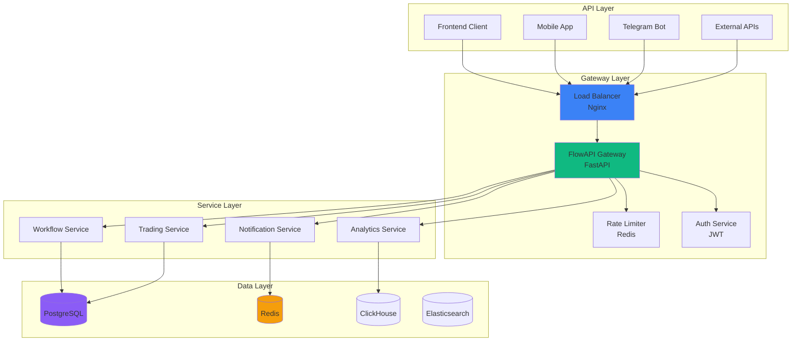

# API Development

Learn how to develop robust, scalable APIs within the Guru Network Framework using modern patterns and best practices.

## API Architecture

<div style={{minHeight: '600px', height: 'auto', margin: '20px 0', width: '100%', overflow: 'auto'}}>
<Frame>

</Frame>
</div>

## API Development Patterns

### 🏗️ RESTful API Design

<AccordionGroup>
  <Accordion title="Resource Naming Conventions">
    ```python
    # ✅ Good: Plural nouns, hierarchical
    GET    /api/v1/workflows              # List workflows
    POST   /api/v1/workflows              # Create workflow
    GET    /api/v1/workflows/{id}         # Get specific workflow
    PUT    /api/v1/workflows/{id}         # Update workflow
    DELETE /api/v1/workflows/{id}         # Delete workflow

    # Nested resources
    GET    /api/v1/workflows/{id}/executions    # List executions
    POST   /api/v1/workflows/{id}/executions    # Start execution
    GET    /api/v1/executions/{id}/status       # Get execution status

    # ❌ Avoid: Verbs in URLs
    POST   /api/v1/workflows/create       # Bad
    GET    /api/v1/workflows/getAll       # Bad
    POST   /api/v1/executeWorkflow        # Bad
    ```
  </Accordion>

  <Accordion title="HTTP Status Codes">
    ```python
    from fastapi import HTTPException, status

    # Success responses
    return JSONResponse(
        status_code=status.HTTP_200_OK,        # GET, PUT successful
        content={"data": result}
    )

    return JSONResponse(
        status_code=status.HTTP_201_CREATED,   # POST successful
        content={"data": created_resource}
    )

    return JSONResponse(
        status_code=status.HTTP_204_NO_CONTENT  # DELETE successful
    )

    # Error responses
    raise HTTPException(
        status_code=status.HTTP_400_BAD_REQUEST,
        detail="Invalid request parameters"
    )

    raise HTTPException(
        status_code=status.HTTP_401_UNAUTHORIZED,
        detail="Authentication required"
    )

    raise HTTPException(
        status_code=status.HTTP_403_FORBIDDEN,
        detail="Insufficient permissions"
    )

    raise HTTPException(
        status_code=status.HTTP_404_NOT_FOUND,
        detail="Resource not found"
    )

    raise HTTPException(
        status_code=status.HTTP_409_CONFLICT,
        detail="Resource already exists"
    )

    raise HTTPException(
        status_code=status.HTTP_422_UNPROCESSABLE_ENTITY,
        detail="Validation error"
    )

    raise HTTPException(
        status_code=status.HTTP_500_INTERNAL_SERVER_ERROR,
        detail="Internal server error"
    )
    ```
  </Accordion>

  <Accordion title="Request/Response Formats">
    ```python
    from pydantic import BaseModel, Field
    from typing import Optional, List
    from datetime import datetime
    from enum import Enum

    # Request models
    class WorkflowCreate(BaseModel):
        name: str = Field(..., min_length=3, max_length=100)
        description: Optional[str] = Field(None, max_length=500)
        category: str = Field(..., regex="^(trading|analytics|notification)$")
        parameters: dict = Field(default_factory=dict)
        is_active: bool = Field(default=True)

        class Config:
            schema_extra = {
                "example": {
                    "name": "Bitcoin Trading Bot",
                    "description": "Automated Bitcoin trading strategy",
                    "category": "trading",
                    "parameters": {
                        "symbol": "BTC/USDT",
                        "strategy": "grid"
                    },
                    "is_active": True
                }
            }

    # Response models
    class WorkflowResponse(BaseModel):
        id: str
        name: str
        description: Optional[str]
        category: str
        status: str
        user_id: str
        created_at: datetime
        updated_at: datetime
        parameters: dict
        is_active: bool

    # List response with pagination
    class WorkflowListResponse(BaseModel):
        data: List[WorkflowResponse]
        pagination: dict = Field(..., example={
            "page": 1,
            "per_page": 20,
            "total": 150,
            "pages": 8
        })

    # Error response
    class ErrorResponse(BaseModel):
        error: str
        message: str
        details: Optional[dict] = None
        timestamp: datetime
        path: str
    ```
  </Accordion>
</AccordionGroup>

### 🔐 Authentication & Authorization

<Tabs>
  <Tab title="JWT Implementation">
    ```python
    from fastapi import Depends, HTTPException, status
    from fastapi.security import HTTPBearer, HTTPAuthorizationCredentials
    from jose import JWTError, jwt
    from datetime import datetime, timedelta

    security = HTTPBearer()

    class JWTHandler:
        def __init__(self, secret_key: str, algorithm: str = "HS256"):
            self.secret_key = secret_key
            self.algorithm = algorithm

        def create_access_token(self, user_id: str, role: str) -> str:
            payload = {
                "sub": user_id,
                "role": role,
                "exp": datetime.utcnow() + timedelta(hours=24),
                "iat": datetime.utcnow(),
                "type": "access"
            }
            return jwt.encode(payload, self.secret_key, algorithm=self.algorithm)

        def verify_token(self, token: str) -> dict:
            try:
                payload = jwt.decode(token, self.secret_key, algorithms=[self.algorithm])
                if payload.get("type") != "access":
                    raise JWTError("Invalid token type")
                return payload
            except JWTError:
                return None

    async def get_current_user(
        credentials: HTTPAuthorizationCredentials = Depends(security)
    ) -> User:
        token = credentials.credentials
        payload = jwt_handler.verify_token(token)

        if not payload:
            raise HTTPException(
                status_code=status.HTTP_401_UNAUTHORIZED,
                detail="Invalid or expired token"
            )

        user = await user_service.get_by_id(payload["sub"])
        if not user:
            raise HTTPException(
                status_code=status.HTTP_401_UNAUTHORIZED,
                detail="User not found"
            )

        return user

    # Usage in endpoints
    @app.get("/api/v1/workflows")
    async def list_workflows(
        current_user: User = Depends(get_current_user)
    ):
        return await workflow_service.list_by_user(current_user.id)
    ```
  </Tab>
  <Tab title="Permission Decorators">
    ```python
    from functools import wraps
    from typing import List

    def require_permission(permission: str):
        def decorator(func):
            @wraps(func)
            async def wrapper(*args, **kwargs):
                current_user = kwargs.get('current_user')
                if not current_user:
                    raise HTTPException(
                        status_code=status.HTTP_401_UNAUTHORIZED,
                        detail="Authentication required"
                    )

                if not has_permission(current_user, permission):
                    raise HTTPException(
                        status_code=status.HTTP_403_FORBIDDEN,
                        detail=f"Permission '{permission}' required"
                    )

                return await func(*args, **kwargs)
            return wrapper
        return decorator

    def require_role(roles: List[str]):
        def decorator(func):
            @wraps(func)
            async def wrapper(*args, **kwargs):
                current_user = kwargs.get('current_user')
                if current_user.role not in roles:
                    raise HTTPException(
                        status_code=status.HTTP_403_FORBIDDEN,
                        detail=f"Role in {roles} required"
                    )
                return await func(*args, **kwargs)
            return wrapper
        return decorator

    # Usage
    @app.post("/api/v1/workflows")
    @require_permission("workflow:create")
    async def create_workflow(
        workflow_data: WorkflowCreate,
        current_user: User = Depends(get_current_user)
    ):
        return await workflow_service.create(workflow_data, current_user)

    @app.delete("/api/v1/workflows/{workflow_id}")
    @require_role(["admin", "developer"])
    async def delete_workflow(
        workflow_id: str,
        current_user: User = Depends(get_current_user)
    ):
        return await workflow_service.delete(workflow_id)
    ```
  </Tab>
</Tabs>

### 📊 Data Validation & Serialization

<CodeGroup>
```python Pydantic Models
from pydantic import BaseModel, validator, Field
from typing import Optional, List, Dict, Any
from decimal import Decimal
from datetime import datetime

class TradingStrategyCreate(BaseModel):
    name: str = Field(..., min_length=3, max_length=100)
    symbol: str = Field(..., regex="^[A-Z]{3,10}/[A-Z]{3,10}$")
    strategy_type: str = Field(..., regex="^(grid|dca|arbitrage|trend)$")
    budget: Decimal = Field(..., gt=0, decimal_places=2)
    risk_level: int = Field(..., ge=1, le=5)
    parameters: Dict[str, Any] = Field(default_factory=dict)

    @validator('symbol')
    def validate_symbol(cls, v):
        supported_symbols = ['BTC/USDT', 'ETH/USDT', 'BNB/USDT']
        if v not in supported_symbols:
            raise ValueError(f'Symbol must be one of: {supported_symbols}')
        return v

    @validator('parameters')
    def validate_parameters(cls, v, values):
        strategy_type = values.get('strategy_type')

        if strategy_type == 'grid':
            required_params = ['grid_spacing', 'grid_levels']
            missing = [p for p in required_params if p not in v]
            if missing:
                raise ValueError(f'Grid strategy requires: {missing}')

        return v

    class Config:
        schema_extra = {
            "example": {
                "name": "BTC Grid Strategy",
                "symbol": "BTC/USDT",
                "strategy_type": "grid",
                "budget": "1000.00",
                "risk_level": 3,
                "parameters": {
                    "grid_spacing": 0.01,
                    "grid_levels": 10,
                    "take_profit": 0.02
                }
            }
        }
```

```python Response Serialization
from pydantic import BaseModel
from typing import Union, Optional
from datetime import datetime

class APIResponse(BaseModel):
    success: bool = True
    message: Optional[str] = None
    data: Optional[Union[dict, list]] = None
    errors: Optional[list] = None
    meta: Optional[dict] = None
    timestamp: datetime = Field(default_factory=datetime.utcnow)

    @classmethod
    def success_response(
        cls,
        data: Any = None,
        message: str = None,
        meta: dict = None
    ):
        return cls(
            success=True,
            message=message,
            data=data,
            meta=meta
        )

    @classmethod
    def error_response(
        cls,
        message: str,
        errors: list = None,
        data: Any = None
    ):
        return cls(
            success=False,
            message=message,
            errors=errors,
            data=data
        )

# Usage in endpoints
@app.post("/api/v1/strategies", response_model=APIResponse)
async def create_strategy(
    strategy: TradingStrategyCreate,
    current_user: User = Depends(get_current_user)
):
    try:
        created_strategy = await strategy_service.create(strategy, current_user)
        return APIResponse.success_response(
            data=created_strategy,
            message="Strategy created successfully"
        )
    except ValidationError as e:
        return APIResponse.error_response(
            message="Validation failed",
            errors=[str(error) for error in e.errors()]
        )
```
</CodeGroup>

## Database Integration

### 🗄️ SQLAlchemy Patterns

<Tabs>
  <Tab title="Model Definition">
    ```python
    from sqlalchemy import Column, String, DateTime, Boolean, Text, ForeignKey, Numeric
    from sqlalchemy.dialects.postgresql import UUID, JSONB
    from sqlalchemy.ext.declarative import declarative_base
    from sqlalchemy.orm import relationship
    from datetime import datetime
    import uuid

    Base = declarative_base()

    class User(Base):
        __tablename__ = "users"

        id = Column(UUID(as_uuid=True), primary_key=True, default=uuid.uuid4)
        username = Column(String(50), unique=True, nullable=False, index=True)
        email = Column(String(255), unique=True, nullable=False, index=True)
        password_hash = Column(String(255), nullable=False)
        role = Column(String(20), nullable=False, default="user")
        is_active = Column(Boolean, default=True)
        created_at = Column(DateTime, default=datetime.utcnow)
        updated_at = Column(DateTime, default=datetime.utcnow, onupdate=datetime.utcnow)

        # Relationships
        workflows = relationship("Workflow", back_populates="user", cascade="all, delete-orphan")
        strategies = relationship("TradingStrategy", back_populates="user")

    class Workflow(Base):
        __tablename__ = "workflows"

        id = Column(UUID(as_uuid=True), primary_key=True, default=uuid.uuid4)
        name = Column(String(100), nullable=False)
        description = Column(Text)
        definition = Column(JSONB)  # BPMN definition
        status = Column(String(20), default="active")
        user_id = Column(UUID(as_uuid=True), ForeignKey("users.id"), nullable=False)
        created_at = Column(DateTime, default=datetime.utcnow)
        updated_at = Column(DateTime, default=datetime.utcnow, onupdate=datetime.utcnow)

        # Relationships
        user = relationship("User", back_populates="workflows")
        executions = relationship("WorkflowExecution", back_populates="workflow")

    class TradingStrategy(Base):
        __tablename__ = "trading_strategies"

        id = Column(UUID(as_uuid=True), primary_key=True, default=uuid.uuid4)
        name = Column(String(100), nullable=False)
        symbol = Column(String(20), nullable=False)
        strategy_type = Column(String(20), nullable=False)
        budget = Column(Numeric(precision=18, scale=8), nullable=False)
        risk_level = Column(Integer, nullable=False)
        parameters = Column(JSONB, default=dict)
        is_active = Column(Boolean, default=True)
        user_id = Column(UUID(as_uuid=True), ForeignKey("users.id"), nullable=False)
        created_at = Column(DateTime, default=datetime.utcnow)

        # Relationships
        user = relationship("User", back_populates="strategies")
    ```
  </Tab>
  <Tab title="Repository Pattern">
    ```python
    from abc import ABC, abstractmethod
    from typing import List, Optional, Dict, Any
    from sqlalchemy.orm import Session
    from sqlalchemy import and_, or_, desc

    class BaseRepository(ABC):
        def __init__(self, session: Session, model_class):
            self.session = session
            self.model_class = model_class

        async def create(self, **kwargs) -> Any:
            instance = self.model_class(**kwargs)
            self.session.add(instance)
            await self.session.commit()
            await self.session.refresh(instance)
            return instance

        async def get_by_id(self, id: str) -> Optional[Any]:
            return await self.session.get(self.model_class, id)

        async def list(
            self,
            limit: int = 100,
            offset: int = 0,
            filters: Dict[str, Any] = None,
            order_by: str = None
        ) -> List[Any]:
            query = self.session.query(self.model_class)

            if filters:
                for key, value in filters.items():
                    if hasattr(self.model_class, key):
                        query = query.filter(getattr(self.model_class, key) == value)

            if order_by:
                if order_by.startswith('-'):
                    query = query.order_by(desc(getattr(self.model_class, order_by[1:])))
                else:
                    query = query.order_by(getattr(self.model_class, order_by))

            return query.offset(offset).limit(limit).all()

        async def update(self, id: str, **kwargs) -> Optional[Any]:
            instance = await self.get_by_id(id)
            if instance:
                for key, value in kwargs.items():
                    if hasattr(instance, key):
                        setattr(instance, key, value)
                await self.session.commit()
                await self.session.refresh(instance)
            return instance

        async def delete(self, id: str) -> bool:
            instance = await self.get_by_id(id)
            if instance:
                await self.session.delete(instance)
                await self.session.commit()
                return True
            return False

    class WorkflowRepository(BaseRepository):
        def __init__(self, session: Session):
            super().__init__(session, Workflow)

        async def get_by_user(self, user_id: str) -> List[Workflow]:
            return await self.list(filters={"user_id": user_id})

        async def get_active_workflows(self) -> List[Workflow]:
            return self.session.query(Workflow).filter(
                and_(
                    Workflow.status == "active",
                    Workflow.user.has(User.is_active == True)
                )
            ).all()

        async def search(self, query: str, user_id: str) -> List[Workflow]:
            return self.session.query(Workflow).filter(
                and_(
                    Workflow.user_id == user_id,
                    or_(
                        Workflow.name.ilike(f"%{query}%"),
                        Workflow.description.ilike(f"%{query}%")
                    )
                )
            ).all()
    ```
  </Tab>
</Tabs>

### 📈 Database Optimization

<AccordionGroup>
  <Accordion title="Query Optimization">
    ```python
    from sqlalchemy.orm import selectinload, joinedload
    from sqlalchemy import select, func

    class OptimizedWorkflowRepository(WorkflowRepository):

        async def get_with_executions(self, workflow_id: str) -> Optional[Workflow]:
            """Load workflow with executions using selectinload to avoid N+1"""
            stmt = select(Workflow).options(
                selectinload(Workflow.executions)
            ).where(Workflow.id == workflow_id)

            result = await self.session.execute(stmt)
            return result.scalar_one_or_none()

        async def get_user_stats(self, user_id: str) -> Dict[str, int]:
            """Aggregate statistics for user workflows"""
            result = await self.session.execute(
                select([
                    func.count(Workflow.id).label('total_workflows'),
                    func.count(case([(Workflow.status == 'active', 1)])).label('active_workflows'),
                    func.count(WorkflowExecution.id).label('total_executions')
                ])
                .select_from(Workflow)
                .outerjoin(WorkflowExecution)
                .where(Workflow.user_id == user_id)
            )

            row = result.first()
            return {
                'total_workflows': row.total_workflows or 0,
                'active_workflows': row.active_workflows or 0,
                'total_executions': row.total_executions or 0
            }

        async def get_paginated(
            self,
            page: int = 1,
            per_page: int = 20,
            user_id: str = None
        ) -> Dict[str, Any]:
            """Paginated results with count"""
            offset = (page - 1) * per_page

            query = select(Workflow)
            if user_id:
                query = query.where(Workflow.user_id == user_id)

            # Get total count
            count_query = select(func.count(Workflow.id))
            if user_id:
                count_query = count_query.where(Workflow.user_id == user_id)

            total = await self.session.scalar(count_query)

            # Get paginated results
            workflows = await self.session.execute(
                query.offset(offset).limit(per_page)
            )

            return {
                'data': workflows.scalars().all(),
                'pagination': {
                    'page': page,
                    'per_page': per_page,
                    'total': total,
                    'pages': (total + per_page - 1) // per_page
                }
            }
    ```
  </Accordion>

  <Accordion title="Connection Pooling">
    ```python
    from sqlalchemy.ext.asyncio import create_async_engine, AsyncSession
    from sqlalchemy.orm import sessionmaker
    from sqlalchemy.pool import QueuePool

    # Database configuration
    DATABASE_CONFIG = {
        'pool_size': 20,           # Number of connections to maintain
        'max_overflow': 30,        # Additional connections when pool is full
        'pool_pre_ping': True,     # Verify connections before use
        'pool_recycle': 3600,      # Recycle connections after 1 hour
        'echo': False,             # Set to True for SQL logging in dev
    }

    # Create async engine
    engine = create_async_engine(
        DATABASE_URL,
        poolclass=QueuePool,
        **DATABASE_CONFIG
    )

    # Session factory
    AsyncSessionLocal = sessionmaker(
        engine,
        class_=AsyncSession,
        expire_on_commit=False
    )

    # Dependency for FastAPI
    async def get_db() -> AsyncSession:
        async with AsyncSessionLocal() as session:
            try:
                yield session
            except Exception:
                await session.rollback()
                raise
            finally:
                await session.close()

    # Usage in endpoints
    @app.get("/api/v1/workflows")
    async def list_workflows(
        page: int = Query(1, ge=1),
        per_page: int = Query(20, ge=1, le=100),
        db: AsyncSession = Depends(get_db),
        current_user: User = Depends(get_current_user)
    ):
        repo = WorkflowRepository(db)
        return await repo.get_paginated(page, per_page, current_user.id)
    ```
  </Accordion>
</AccordionGroup>

## Error Handling & Logging

### 🚨 Exception Handling

<CodeGroup>
```python Custom Exceptions
class GuruAPIException(Exception):
    """Base exception for Guru API"""
    def __init__(self, message: str, status_code: int = 500, details: dict = None):
        self.message = message
        self.status_code = status_code
        self.details = details or {}
        super().__init__(self.message)

class ValidationException(GuruAPIException):
    def __init__(self, message: str, details: dict = None):
        super().__init__(message, 422, details)

class NotFoundException(GuruAPIException):
    def __init__(self, resource: str, id: str):
        message = f"{resource} with id '{id}' not found"
        super().__init__(message, 404)

class PermissionDeniedException(GuruAPIException):
    def __init__(self, action: str):
        message = f"Permission denied for action: {action}"
        super().__init__(message, 403)

class BusinessLogicException(GuruAPIException):
    def __init__(self, message: str, details: dict = None):
        super().__init__(message, 400, details)

# Global exception handler
@app.exception_handler(GuruAPIException)
async def guru_exception_handler(request: Request, exc: GuruAPIException):
    return JSONResponse(
        status_code=exc.status_code,
        content={
            "error": exc.__class__.__name__,
            "message": exc.message,
            "details": exc.details,
            "timestamp": datetime.utcnow().isoformat(),
            "path": str(request.url)
        }
    )

@app.exception_handler(ValidationError)
async def validation_exception_handler(request: Request, exc: ValidationError):
    return JSONResponse(
        status_code=422,
        content={
            "error": "ValidationError",
            "message": "Request validation failed",
            "details": exc.errors(),
            "timestamp": datetime.utcnow().isoformat(),
            "path": str(request.url)
        }
    )
```

```python Structured Logging
import structlog
from pythonjsonlogger import jsonlogger
import logging.config

# Configure structured logging
logging.config.dictConfig({
    "version": 1,
    "disable_existing_loggers": False,
    "formatters": {
        "json": {
            "()": jsonlogger.JsonFormatter,
            "format": "%(asctime)s %(name)s %(levelname)s %(message)s"
        }
    },
    "handlers": {
        "console": {
            "class": "logging.StreamHandler",
            "formatter": "json",
            "stream": "ext://sys.stdout"
        },
        "file": {
            "class": "logging.handlers.RotatingFileHandler",
            "formatter": "json",
            "filename": "logs/api.log",
            "maxBytes": 10485760,  # 10MB
            "backupCount": 5
        }
    },
    "loggers": {
        "guru_api": {
            "handlers": ["console", "file"],
            "level": "INFO",
            "propagate": False
        }
    }
})

# Configure structlog
structlog.configure(
    processors=[
        structlog.stdlib.filter_by_level,
        structlog.stdlib.add_logger_name,
        structlog.stdlib.add_log_level,
        structlog.stdlib.PositionalArgumentsFormatter(),
        structlog.processors.TimeStamper(fmt="iso"),
        structlog.processors.StackInfoRenderer(),
        structlog.processors.format_exc_info,
        structlog.processors.UnicodeDecoder(),
        structlog.processors.JSONRenderer()
    ],
    context_class=dict,
    logger_factory=structlog.stdlib.LoggerFactory(),
    wrapper_class=structlog.stdlib.BoundLogger,
    cache_logger_on_first_use=True,
)

logger = structlog.get_logger("guru_api")

# Usage in services
class WorkflowService:
    def __init__(self):
        self.logger = structlog.get_logger(self.__class__.__name__)

    async def create_workflow(self, workflow_data: WorkflowCreate, user: User):
        self.logger.info(
            "Creating workflow",
            user_id=user.id,
            workflow_name=workflow_data.name,
            workflow_type=workflow_data.category
        )

        try:
            workflow = await self.repository.create(**workflow_data.dict(), user_id=user.id)

            self.logger.info(
                "Workflow created successfully",
                workflow_id=workflow.id,
                user_id=user.id
            )

            return workflow

        except Exception as e:
            self.logger.error(
                "Failed to create workflow",
                user_id=user.id,
                error=str(e),
                exc_info=True
            )
            raise BusinessLogicException("Failed to create workflow")
```
</CodeGroup>

## API Testing

### 🧪 Test Implementation

<Tabs>
  <Tab title="Unit Tests">
    ```python
    import pytest
    from httpx import AsyncClient
    from fastapi.testclient import TestClient
    from unittest.mock import AsyncMock, patch

    @pytest.fixture
    def mock_user():
        return User(
            id="user-123",
            username="testuser",
            email="test@example.com",
            role="user"
        )

    @pytest.fixture
    def mock_workflow():
        return Workflow(
            id="workflow-123",
            name="Test Workflow",
            description="Test description",
            user_id="user-123",
            status="active"
        )

    class TestWorkflowAPI:

        @pytest.mark.asyncio
        async def test_create_workflow_success(self, mock_user):
            workflow_data = {
                "name": "Test Workflow",
                "description": "Test description",
                "category": "trading"
            }

            with patch('app.dependencies.get_current_user', return_value=mock_user):
                with patch('app.services.workflow_service.create') as mock_create:
                    mock_create.return_value = Workflow(**workflow_data, id="workflow-123")

                    async with AsyncClient(app=app, base_url="http://test") as client:
                        response = await client.post(
                            "/api/v1/workflows",
                            json=workflow_data,
                            headers={"Authorization": "Bearer fake-token"}
                        )

                    assert response.status_code == 201
                    assert response.json()["data"]["name"] == workflow_data["name"]

        @pytest.mark.asyncio
        async def test_create_workflow_validation_error(self, mock_user):
            invalid_data = {
                "name": "A",  # Too short
                "category": "invalid"  # Invalid category
            }

            with patch('app.dependencies.get_current_user', return_value=mock_user):
                async with AsyncClient(app=app, base_url="http://test") as client:
                    response = await client.post(
                        "/api/v1/workflows",
                        json=invalid_data,
                        headers={"Authorization": "Bearer fake-token"}
                    )

                assert response.status_code == 422
                assert "validation" in response.json()["message"].lower()

        @pytest.mark.asyncio
        async def test_get_workflow_not_found(self, mock_user):
            with patch('app.dependencies.get_current_user', return_value=mock_user):
                with patch('app.services.workflow_service.get_by_id', return_value=None):
                    async with AsyncClient(app=app, base_url="http://test") as client:
                        response = await client.get(
                            "/api/v1/workflows/nonexistent",
                            headers={"Authorization": "Bearer fake-token"}
                        )

                    assert response.status_code == 404

        @pytest.mark.asyncio
        async def test_unauthorized_access(self):
            async with AsyncClient(app=app, base_url="http://test") as client:
                response = await client.get("/api/v1/workflows")

            assert response.status_code == 401
    ```
  </Tab>
  <Tab title="Integration Tests">
    ```python
    import pytest
    from fastapi.testclient import TestClient
    from sqlalchemy import create_engine
    from sqlalchemy.orm import sessionmaker
    from testcontainers.postgres import PostgresContainer

    @pytest.fixture(scope="session")
    def postgres_container():
        with PostgresContainer("postgres:15") as postgres:
            yield postgres

    @pytest.fixture(scope="session")
    def test_db(postgres_container):
        engine = create_engine(postgres_container.get_connection_url())
        Base.metadata.create_all(engine)

        TestingSessionLocal = sessionmaker(autocommit=False, autoflush=False, bind=engine)

        yield TestingSessionLocal

        Base.metadata.drop_all(engine)

    @pytest.fixture
    def test_client(test_db):
        def override_get_db():
            db = test_db()
            try:
                yield db
            finally:
                db.close()

        app.dependency_overrides[get_db] = override_get_db

        with TestClient(app) as client:
            yield client

        app.dependency_overrides.clear()

    class TestWorkflowIntegration:

        def test_complete_workflow_lifecycle(self, test_client):
            # 1. Register user
            user_data = {
                "username": "testuser",
                "email": "test@example.com",
                "password": "TestPassword123!"
            }
            response = test_client.post("/api/v1/auth/register", json=user_data)
            assert response.status_code == 201

            # 2. Login
            login_data = {
                "email": user_data["email"],
                "password": user_data["password"]
            }
            response = test_client.post("/api/v1/auth/login", json=login_data)
            assert response.status_code == 200
            token = response.json()["access_token"]

            headers = {"Authorization": f"Bearer {token}"}

            # 3. Create workflow
            workflow_data = {
                "name": "Integration Test Workflow",
                "description": "Test workflow for integration tests",
                "category": "trading"
            }
            response = test_client.post("/api/v1/workflows", json=workflow_data, headers=headers)
            assert response.status_code == 201
            workflow_id = response.json()["data"]["id"]

            # 4. Get workflow
            response = test_client.get(f"/api/v1/workflows/{workflow_id}", headers=headers)
            assert response.status_code == 200
            assert response.json()["data"]["name"] == workflow_data["name"]

            # 5. Update workflow
            update_data = {"description": "Updated description"}
            response = test_client.put(f"/api/v1/workflows/{workflow_id}", json=update_data, headers=headers)
            assert response.status_code == 200
            assert response.json()["data"]["description"] == update_data["description"]

            # 6. List workflows
            response = test_client.get("/api/v1/workflows", headers=headers)
            assert response.status_code == 200
            assert len(response.json()["data"]) == 1

            # 7. Delete workflow
            response = test_client.delete(f"/api/v1/workflows/{workflow_id}", headers=headers)
            assert response.status_code == 204

            # 8. Verify deletion
            response = test_client.get(f"/api/v1/workflows/{workflow_id}", headers=headers)
            assert response.status_code == 404
    ```
  </Tab>
</Tabs>

## Performance & Monitoring

### 📊 API Metrics

<CodeGroup>
```python Metrics Collection
from prometheus_client import Counter, Histogram, Gauge, generate_latest
import time

# Metrics
REQUEST_COUNT = Counter(
    'api_requests_total',
    'Total API requests',
    ['method', 'endpoint', 'status_code']
)

REQUEST_DURATION = Histogram(
    'api_request_duration_seconds',
    'API request duration',
    ['method', 'endpoint']
)

ACTIVE_CONNECTIONS = Gauge(
    'api_active_connections',
    'Number of active connections'
)

DB_CONNECTIONS = Gauge(
    'db_connections_active',
    'Active database connections'
)

# Middleware
@app.middleware("http")
async def metrics_middleware(request: Request, call_next):
    start_time = time.time()

    # Increment active connections
    ACTIVE_CONNECTIONS.inc()

    try:
        response = await call_next(request)

        # Record metrics
        REQUEST_COUNT.labels(
            method=request.method,
            endpoint=request.url.path,
            status_code=response.status_code
        ).inc()

        REQUEST_DURATION.labels(
            method=request.method,
            endpoint=request.url.path
        ).observe(time.time() - start_time)

        return response

    finally:
        ACTIVE_CONNECTIONS.dec()

# Metrics endpoint
@app.get("/metrics")
async def metrics():
    return Response(generate_latest(), media_type="text/plain")
```

```python Rate Limiting
from fastapi import HTTPException
import asyncio
import time
from typing import Dict

class RateLimiter:
    def __init__(self, requests: int, window: int):
        self.requests = requests
        self.window = window
        self.clients: Dict[str, list] = {}

    async def is_allowed(self, client_id: str) -> bool:
        now = time.time()

        # Clean old requests
        if client_id in self.clients:
            self.clients[client_id] = [
                req_time for req_time in self.clients[client_id]
                if now - req_time < self.window
            ]
        else:
            self.clients[client_id] = []

        # Check rate limit
        if len(self.clients[client_id]) >= self.requests:
            return False

        # Add current request
        self.clients[client_id].append(now)
        return True

# Rate limiting middleware
rate_limiter = RateLimiter(requests=100, window=60)  # 100 requests per minute

@app.middleware("http")
async def rate_limit_middleware(request: Request, call_next):
    client_ip = request.client.host

    if not await rate_limiter.is_allowed(client_ip):
        raise HTTPException(
            status_code=429,
            detail="Rate limit exceeded",
            headers={"Retry-After": "60"}
        )

    return await call_next(request)
```
</CodeGroup>

## Next Steps

<CardGroup cols={2}>
  <Card title="Testing Guide" icon="flask" href="/development/testing">
    Comprehensive testing strategies and implementation
  </Card>
  <Card title="Security Documentation" icon="shield" href="/security/api-security">
    API security best practices and implementation
  </Card>
</CardGroup>

<Note>
  Following these API development patterns ensures consistency, maintainability, and scalability across the Guru Network Framework. Always prioritize security, performance, and developer experience in your API design decisions.
</Note>