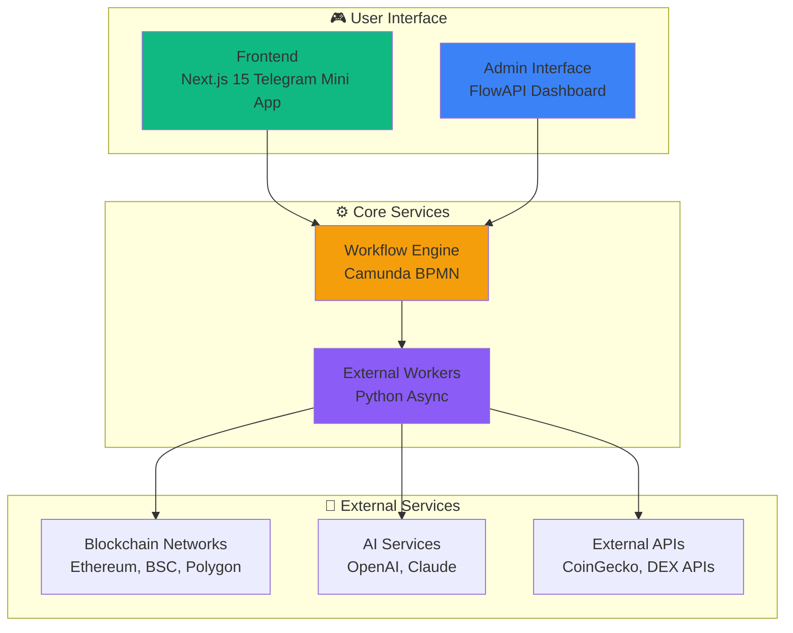

# Welcome to Guru Network Framework

Web3 automation platform that bridges traditional web services with blockchain technology through BPMN workflow orchestration.

## What is Guru Network?

Guru Network Framework is a workflow automation platform that combines:

- **BPMN Workflow Engine** - Camunda-powered process orchestration
- **Python Workers** - Async task processing for blockchain and AI operations
- **Web Interface** - Next.js frontend with Telegram Mini App support
- **Web3 Integration** - Direct blockchain interaction and DeFi automation
- **Admin Tools** - FlowAPI admin interface for management and monitoring

## Key Features

<CardGroup cols={2}>
  <Card title="Workflow Orchestration" icon="diagram-project">
    Visual workflow design with BPMN 2.0 standards for complex automation scenarios
  </Card>
  <Card title="Blockchain Integration" icon="link">
    Native support for Ethereum, BSC, Polygon with automated trading and DeFi operations
  </Card>
  <Card title="BPMN Orchestration" icon="arrows-maximize">
    Visual workflow design with Camunda engine for complex automation scenarios
  </Card>
  <Card title="Non-Custodial Workers" icon="shield-check">
    Secure external workers that process tasks without holding user assets
  </Card>
</CardGroup>

## Quick Navigation

<CardGroup cols={3}>
  <Card title="Get Started" icon="rocket" href="/introduction/overview">
    Learn about the framework architecture and core concepts
  </Card>
  <Card title="Components" icon="puzzle-piece" href="/components/engine">
    Explore the core services and their functionality
  </Card>
  <Card title="Development" icon="code" href="/development/environment">
    Set up your development environment and start building
  </Card>
</CardGroup>

## Architecture Overview

The Guru Network Framework uses a simple component-based architecture:

<Frame>

</Frame>

## Use Cases

The framework supports various automation scenarios:

- **DeFi Trading Bots** - Automated trading strategies across multiple DEXs
- **Yield Farming** - Automated liquidity provision and reward harvesting
- **Portfolio Management** - Dynamic rebalancing and risk management
- **Notification Systems** - Real-time alerts for market conditions and events
- **Data Analytics** - Blockchain data collection and analysis workflows

## Getting Help

<CardGroup cols={2}>
  <Card title="Documentation" icon="book">
    Comprehensive guides covering all aspects of the framework
  </Card>
  <Card title="Troubleshooting" icon="wrench" href="/troubleshooting/common-issues">
    Common issues and their solutions
  </Card>
</CardGroup>

Ready to get started? Check out our [quick installation guide](/quick-start/installation) or explore our [comprehensive features](/introduction/features).

## 🚀 Quick Links

<CardGroup cols={3}>
  <Card title="Quick Installation" icon="download" href="/quick-start/installation">
    Get up and running in 5 minutes
  </Card>
  <Card title="System Architecture" icon="sitemap" href="/architecture/system-design">
    Understand the framework design
  </Card>
  <Card title="Development Setup" icon="laptop-code" href="/development/environment">
    Configure your dev environment
  </Card>
</CardGroup>