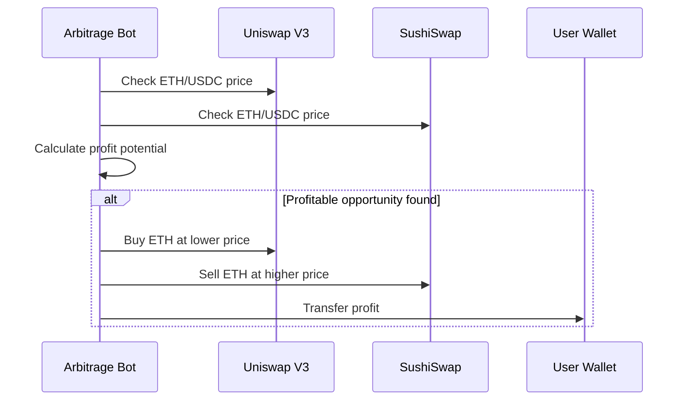

# Use Cases

The Guru Network Framework enables a wide range of Web3 automation scenarios, from simple trading bots to complex enterprise integrations. Here are some practical examples of how organizations and developers are using the platform.

## 🤖 Automated Trading Strategies

### Dollar-Cost Averaging (DCA) Bot
<Card title="Steady Investment Growth" icon="chart-line">
Automatically purchase crypto assets at regular intervals, regardless of price fluctuations, to reduce the impact of volatility over time.
</Card>

**Implementation Example:**
```python
# DCA Strategy Configuration
dca_strategy = {
    "name": "Bitcoin DCA",
    "asset": "BTC",
    "purchase_amount": 100,  # $100 USD
    "frequency": "weekly",   # Every Monday
    "exchanges": ["binance", "coinbase"],
    "slippage_tolerance": 0.5,
    "max_gas_price": 50
}

# Automated execution with risk management
workflow.add_task("check_market_conditions")
workflow.add_task("execute_purchase", retry_count=3)
workflow.add_task("record_transaction")
workflow.add_task("update_portfolio")
```

**Key Benefits:**
- Reduces emotional trading decisions
- Automatic rebalancing and portfolio updates
- Multi-exchange execution for better pricing
- Built-in risk management and error handling

### Arbitrage Trading Bot
<Card title="Cross-Exchange Profit" icon="arrows-rotate">
Identify and exploit price differences across multiple exchanges or DEXs to generate consistent profits with minimal risk.
</Card>

**Real-World Scenario:**
<div style={{minHeight: '500px', height: 'auto', margin: '20px 0', width: '100%', overflow: 'auto'}}>

</div>

**Advanced Features:**
- **MEV Protection**: Frontrunning detection and mitigation
- **Gas Optimization**: Dynamic gas pricing for maximum profitability
- **Flash Loans**: Capital-efficient arbitrage without initial investment
- **Multi-hop Routing**: Complex arbitrage paths across multiple protocols

### Grid Trading System
<Card title="Range-Bound Markets" icon="grid-4">
Place buy and sell orders at predetermined intervals above and below the current market price to profit from market volatility.
</Card>

**Configuration Example:**
```yaml
grid_strategy:
  symbol: "ETH/USDC"
  price_range:
    lower_bound: 1800
    upper_bound: 2200
  grid_levels: 20
  order_size: 0.1  # ETH per order
  take_profit: 1.5%
  stop_loss: 5%
  rebalancing: "daily"
```

## 🏦 DeFi Protocol Automation

### Yield Farming Optimizer
<AccordionGroup>
  <Accordion title="Automated Liquidity Management">
    Monitor yield farming opportunities across protocols like Aave, Compound, and Curve, automatically moving funds to highest-yield positions while managing impermanent loss risk.

    **Strategy Components:**
    - APY monitoring across 50+ protocols
    - Impermanent loss calculation and mitigation
    - Gas cost optimization for yield movements
    - Automatic reward claiming and compounding
  </Accordion>

  <Accordion title="Liquidity Pool Rebalancing">
    Maintain optimal asset ratios in liquidity pools by automatically adding or removing liquidity based on market conditions and IL thresholds.

    **Implementation:**
    ```python
    # LP Rebalancing Logic
    def rebalance_pool(pool_address, target_ratio, il_threshold):
        current_ratio = get_pool_ratio(pool_address)
        il_percentage = calculate_impermanent_loss(pool_address)

        if il_percentage > il_threshold:
            # Exit position to avoid further losses
            remove_liquidity(pool_address, percentage=100)
        elif abs(current_ratio - target_ratio) > 0.05:
            # Rebalance to maintain target ratio
            adjust_liquidity(pool_address, target_ratio)
    ```
  </Accordion>

  <Accordion title="Lending Protocol Optimization">
    Automatically switch between lending protocols (Aave, Compound, etc.) to maximize interest earned while maintaining desired risk levels.

    **Features:**
    - Real-time APY comparison
    - Collateral ratio monitoring
    - Liquidation risk assessment
    - Automatic position migration
  </Accordion>
</AccordionGroup>

## 🏢 Enterprise Integration

### DAO Treasury Management
<CardGroup cols={2}>
  <Card title="Automated Diversification" icon="pie-chart">
    Implement treasury diversification strategies to reduce single-asset risk and optimize returns across different asset classes.
  </Card>
  <Card title="Governance Integration" icon="vote-yea">
    Execute treasury decisions automatically based on governance votes, with built-in approval workflows and compliance checks.
  </Card>
</CardGroup>

### Corporate DeFi Integration
<Card title="Traditional Finance Meets DeFi" icon="building">
Integrate DeFi protocols into existing corporate treasury operations with enterprise-grade controls and compliance features.
</Card>

**Implementation Example:**
```python
class CorporateTreasuryBot:
    def __init__(self, compliance_rules, approval_limits):
        self.compliance = ComplianceEngine(compliance_rules)
        self.approval_limits = approval_limits

    async def execute_strategy(self, strategy):
        # Compliance check
        if not self.compliance.validate(strategy):
            raise ComplianceViolation("Strategy violates corporate policy")

        # Approval workflow for large amounts
        if strategy.amount > self.approval_limits["auto_approve"]:
            await self.request_approval(strategy)

        # Execute with full audit trail
        result = await self.execute_with_audit(strategy)
        return result
```

## 📊 Portfolio Management

### Dynamic Asset Allocation
<Card title="Intelligent Rebalancing" icon="scale-balanced">
Automatically adjust portfolio allocations based on market conditions, volatility metrics, and predefined risk parameters.
</Card>

### Risk Management Automation
<AccordionGroup>
  <Accordion title="Stop-Loss Automation">
    Implement sophisticated stop-loss strategies that consider market conditions, volatility, and correlation between assets.

    ```python
    # Advanced stop-loss with volatility adjustment
    def calculate_dynamic_stop_loss(asset, position_size, base_stop=0.05):
        volatility = get_30d_volatility(asset)
        correlation = get_correlation_with_market(asset)

        # Adjust stop-loss based on volatility
        adjusted_stop = base_stop * (1 + volatility)

        # Consider correlation for portfolio effect
        if correlation > 0.8:  # High correlation with market
            adjusted_stop *= 1.2  # Tighter stop-loss

        return min(adjusted_stop, 0.15)  # Cap at 15%
    ```
  </Accordion>

  <Accordion title="Position Sizing">
    Automatically calculate optimal position sizes based on portfolio volatility, correlation, and risk budgets.
  </Accordion>
</AccordionGroup>

## 🔔 Monitoring & Alerts

### Market Condition Monitoring
<CardGroup cols={2}>
  <Card title="Volatility Alerts" icon="wave-square">
    Monitor market volatility and adjust strategies automatically when volatility exceeds predefined thresholds.
  </Card>
  <Card title="Correlation Breakdown" icon="chart-scatter">
    Detect when historical correlations break down, indicating potential regime changes or market stress.
  </Card>
</CardGroup>

## 🎯 Getting Started with Use Cases

### Choose Your Starting Point

<Tabs>
  <Tab title="Beginner">
    **Start with Simple DCA**
    - Low risk, proven strategy
    - Easy to understand and monitor
    - Great for learning the platform

    [View Setup Guide →](/development/environment)
  </Tab>
  <Tab title="Intermediate">
    **Yield Farming Automation**
    - Moderate complexity
    - Higher potential returns
    - Good introduction to DeFi

    [View Development Guide →](/development/api-development)
  </Tab>
  <Tab title="Advanced">
    **Multi-Strategy Portfolio**
    - Complex risk management
    - Institutional-grade features
    - Maximum flexibility

    [View Architecture →](/architecture/system-design)
  </Tab>
</Tabs>

### Implementation Support

<CardGroup cols={2}>
  <Card title="Development Environment" icon="laptop-code" href="/development/environment">
    Set up your local development environment to start building
  </Card>
  <Card title="System Architecture" icon="sitemap" href="/architecture/system-design">
    Understand the framework architecture and design patterns
  </Card>
  <Card title="Component Guide" icon="puzzle-piece" href="/components/engine">
    Learn about the core components and their functionality
  </Card>
  <Card title="API Documentation" icon="code" href="/development/api-development">
    Explore the API endpoints and integration patterns
  </Card>
</CardGroup>

## 🚀 Next Steps

Ready to implement your use case? Start with our setup guide:

<CardGroup cols={2}>
  <Card title="Development Setup" icon="rocket" href="/development/environment">
    Get the framework installed and configured in minutes
  </Card>
  <Card title="Architecture Overview" icon="building" href="/architecture/system-design">
    Understand the system design and component interactions
  </Card>
</CardGroup>

<Warning>
  Remember that all automated trading involves risk. Start with small amounts, thoroughly test your strategies, and always maintain appropriate risk management measures.
</Warning>