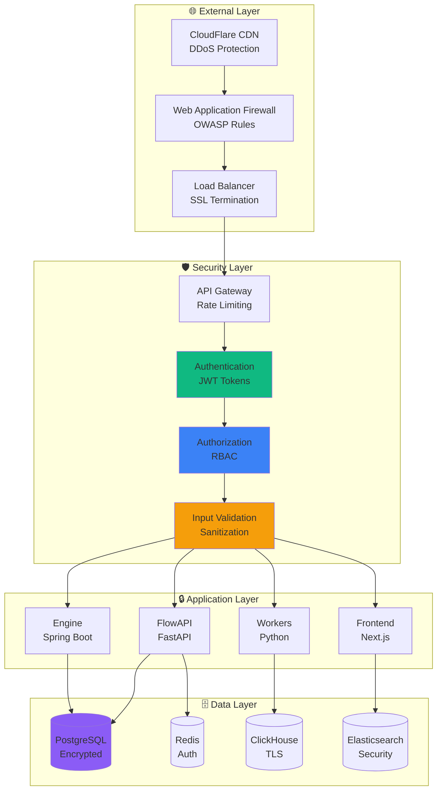

# API Security

Comprehensive security implementation to protect the Guru Network Framework from threats and ensure safe operation in production environments.

## Security Architecture

<div style={{minHeight: '600px', height: 'auto', margin: '20px 0', width: '100%', overflow: 'auto'}}>
<Frame>

</Frame>
</div>

## Authentication Security

### 🔐 JWT Implementation

<Tabs>
  <Tab title="Token Security">
    ```python
    import secrets
    import hashlib
    from datetime import datetime, timedelta
    from jose import JWTError, jwt
    from passlib.context import CryptContext
    from fastapi import HTTPException, status

    class SecureJWTHandler:
        def __init__(self):
            # Use cryptographically strong secret
            self.secret_key = self._generate_secret_key()
            self.algorithm = "HS256"
            self.access_token_expire = timedelta(hours=1)
            self.refresh_token_expire = timedelta(days=30)
            self.pwd_context = CryptContext(schemes=["bcrypt"], deprecated="auto")

        def _generate_secret_key(self) -> str:
            """Generate cryptographically strong secret key"""
            return secrets.token_urlsafe(64)

        def create_access_token(self, user_id: str, role: str, permissions: list = None) -> str:
            """Create secure access token with minimal claims"""
            now = datetime.utcnow()
            payload = {
                "sub": user_id,
                "role": role,
                "permissions": permissions or [],
                "iat": now,
                "exp": now + self.access_token_expire,
                "type": "access",
                "jti": secrets.token_urlsafe(16)  # Unique token ID for revocation
            }

            return jwt.encode(payload, self.secret_key, algorithm=self.algorithm)

        def create_refresh_token(self, user_id: str) -> str:
            """Create secure refresh token"""
            now = datetime.utcnow()
            payload = {
                "sub": user_id,
                "iat": now,
                "exp": now + self.refresh_token_expire,
                "type": "refresh",
                "jti": secrets.token_urlsafe(16)
            }

            return jwt.encode(payload, self.secret_key, algorithm=self.algorithm)

        def verify_token(self, token: str, token_type: str = "access") -> dict:
            """Verify and decode token with security checks"""
            try:
                payload = jwt.decode(
                    token,
                    self.secret_key,
                    algorithms=[self.algorithm],
                    options={"verify_exp": True, "verify_iat": True}
                )

                # Verify token type
                if payload.get("type") != token_type:
                    raise JWTError(f"Invalid token type. Expected {token_type}")

                # Check if token is blacklisted
                if self._is_token_blacklisted(payload.get("jti")):
                    raise JWTError("Token has been revoked")

                return payload

            except JWTError as e:
                raise HTTPException(
                    status_code=status.HTTP_401_UNAUTHORIZED,
                    detail=f"Token validation failed: {str(e)}"
                )

        def _is_token_blacklisted(self, jti: str) -> bool:
            """Check if token is in blacklist (Redis implementation)"""
            # Implementation would check Redis blacklist
            return False

        def blacklist_token(self, jti: str, exp: datetime):
            """Add token to blacklist until expiration"""
            # Implementation would add to Redis with TTL
            pass

        def hash_password(self, password: str) -> str:
            """Hash password securely"""
            return self.pwd_context.hash(password)

        def verify_password(self, plain_password: str, hashed_password: str) -> bool:
            """Verify password against hash"""
            return self.pwd_context.verify(plain_password, hashed_password)
    ```
  </Tab>
  <Tab title="Multi-Factor Authentication">
    ```python
    import pyotp
    import qrcode
    from io import BytesIO
    import base64
    from fastapi import HTTPException

    class MFAHandler:
        def __init__(self):
            self.issuer_name = "Guru Network"

        def generate_secret(self) -> str:
            """Generate TOTP secret for user"""
            return pyotp.random_base32()

        def generate_qr_code(self, user_email: str, secret: str) -> str:
            """Generate QR code for authenticator app setup"""
            totp_uri = pyotp.totp.TOTP(secret).provisioning_uri(
                name=user_email,
                issuer_name=self.issuer_name
            )

            qr = qrcode.QRCode(version=1, box_size=10, border=5)
            qr.add_data(totp_uri)
            qr.make(fit=True)

            img = qr.make_image(fill_color="black", back_color="white")
            buffer = BytesIO()
            img.save(buffer, format="PNG")
            buffer.seek(0)

            return base64.b64encode(buffer.getvalue()).decode()

        def verify_totp(self, secret: str, token: str) -> bool:
            """Verify TOTP token"""
            totp = pyotp.TOTP(secret)
            return totp.verify(token, valid_window=1)  # Allow 30s window

        def generate_backup_codes(self, count: int = 8) -> list:
            """Generate backup codes for account recovery"""
            codes = []
            for _ in range(count):
                code = secrets.token_hex(4).upper()
                codes.append(f"{code[:4]}-{code[4:]}")
            return codes

    # MFA middleware
    async def require_mfa(
        request: Request,
        current_user: User = Depends(get_current_user)
    ):
        """Require MFA for sensitive operations"""
        if current_user.mfa_enabled and not request.session.get("mfa_verified"):
            raise HTTPException(
                status_code=status.HTTP_403_FORBIDDEN,
                detail="MFA verification required"
            )
        return current_user

    # MFA endpoints
    @app.post("/api/auth/mfa/setup")
    async def setup_mfa(
        current_user: User = Depends(get_current_user)
    ):
        """Setup MFA for user account"""
        if current_user.mfa_enabled:
            raise HTTPException(
                status_code=status.HTTP_400_BAD_REQUEST,
                detail="MFA already enabled"
            )

        mfa = MFAHandler()
        secret = mfa.generate_secret()
        qr_code = mfa.generate_qr_code(current_user.email, secret)
        backup_codes = mfa.generate_backup_codes()

        # Store secret temporarily (user must verify before enabling)
        await redis_client.setex(
            f"mfa_setup:{current_user.id}",
            300,  # 5 minutes
            secret
        )

        return {
            "qr_code": qr_code,
            "backup_codes": backup_codes,
            "manual_entry_key": secret
        }

    @app.post("/api/auth/mfa/verify")
    async def verify_mfa(
        token: str,
        current_user: User = Depends(get_current_user),
        db: Session = Depends(get_db)
    ):
        """Verify MFA token and enable MFA"""
        secret = await redis_client.get(f"mfa_setup:{current_user.id}")
        if not secret:
            raise HTTPException(
                status_code=status.HTTP_400_BAD_REQUEST,
                detail="MFA setup session expired"
            )

        mfa = MFAHandler()
        if not mfa.verify_totp(secret, token):
            raise HTTPException(
                status_code=status.HTTP_400_BAD_REQUEST,
                detail="Invalid MFA token"
            )

        # Enable MFA for user
        current_user.mfa_secret = secret
        current_user.mfa_enabled = True
        db.commit()

        # Clear setup session
        await redis_client.delete(f"mfa_setup:{current_user.id}")

        return {"message": "MFA enabled successfully"}
    ```
  </Tab>
</Tabs>

### 🔒 Session Security

<CodeGroup>
```python Session Management
from fastapi import Request, Response
import redis.asyncio as redis
import json
from datetime import timedelta

class SecureSessionManager:
    def __init__(self, redis_client: redis.Redis):
        self.redis = redis_client
        self.session_timeout = timedelta(hours=8)
        self.cookie_name = "__Secure-session"

    async def create_session(self, user_id: str, request: Request) -> str:
        """Create secure session"""
        session_id = secrets.token_urlsafe(32)

        session_data = {
            "user_id": user_id,
            "ip_address": request.client.host,
            "user_agent": request.headers.get("user-agent", ""),
            "created_at": datetime.utcnow().isoformat(),
            "last_activity": datetime.utcnow().isoformat(),
            "mfa_verified": False
        }

        await self.redis.setex(
            f"session:{session_id}",
            self.session_timeout,
            json.dumps(session_data)
        )

        return session_id

    async def validate_session(self, session_id: str, request: Request) -> dict:
        """Validate and update session"""
        session_data = await self.redis.get(f"session:{session_id}")
        if not session_data:
            raise HTTPException(
                status_code=status.HTTP_401_UNAUTHORIZED,
                detail="Session expired or invalid"
            )

        data = json.loads(session_data)

        # Validate IP address (optional, can be disabled for mobile users)
        if data["ip_address"] != request.client.host:
            await self.invalidate_session(session_id)
            raise HTTPException(
                status_code=status.HTTP_401_UNAUTHORIZED,
                detail="Session invalid due to IP change"
            )

        # Update last activity
        data["last_activity"] = datetime.utcnow().isoformat()
        await self.redis.setex(
            f"session:{session_id}",
            self.session_timeout,
            json.dumps(data)
        )

        return data

    async def invalidate_session(self, session_id: str):
        """Invalidate session"""
        await self.redis.delete(f"session:{session_id}")

    def set_secure_cookie(self, response: Response, session_id: str):
        """Set secure session cookie"""
        response.set_cookie(
            key=self.cookie_name,
            value=session_id,
            max_age=int(self.session_timeout.total_seconds()),
            httponly=True,  # Prevent XSS
            secure=True,    # HTTPS only
            samesite="strict"  # CSRF protection
        )

    def clear_cookie(self, response: Response):
        """Clear session cookie"""
        response.delete_cookie(key=self.cookie_name)
```

```python Rate Limiting
from collections import defaultdict
import time
from fastapi import HTTPException, Request

class RateLimiter:
    def __init__(self, redis_client: redis.Redis):
        self.redis = redis_client

    async def check_rate_limit(
        self,
        key: str,
        limit: int,
        window: int,
        request: Request
    ) -> bool:
        """Check if request is within rate limit"""
        current_time = int(time.time())
        window_start = current_time - window

        # Use sliding window log algorithm
        pipe = self.redis.pipeline()

        # Remove old entries
        pipe.zremrangebyscore(f"rate_limit:{key}", 0, window_start)

        # Count current requests
        pipe.zcard(f"rate_limit:{key}")

        # Add current request
        pipe.zadd(f"rate_limit:{key}", {str(current_time): current_time})

        # Set expiration
        pipe.expire(f"rate_limit:{key}", window + 1)

        results = await pipe.execute()
        current_requests = results[1]

        if current_requests >= limit:
            # Log rate limit violation
            await self._log_rate_limit_violation(key, request)
            return False

        return True

    async def _log_rate_limit_violation(self, key: str, request: Request):
        """Log rate limit violations for monitoring"""
        violation_data = {
            "key": key,
            "ip": request.client.host,
            "user_agent": request.headers.get("user-agent", ""),
            "timestamp": datetime.utcnow().isoformat(),
            "path": str(request.url)
        }

        # Store in Redis for monitoring
        await self.redis.lpush(
            "rate_limit_violations",
            json.dumps(violation_data)
        )
        await self.redis.ltrim("rate_limit_violations", 0, 1000)  # Keep last 1000

# Rate limiting middleware
@app.middleware("http")
async def rate_limit_middleware(request: Request, call_next):
    rate_limiter = RateLimiter(redis_client)

    # Different limits for different endpoints
    if request.url.path.startswith("/api/auth"):
        # Strict limits for auth endpoints
        if not await rate_limiter.check_rate_limit(
            f"auth:{request.client.host}",
            limit=5,
            window=300,  # 5 requests per 5 minutes
            request=request
        ):
            raise HTTPException(
                status_code=status.HTTP_429_TOO_MANY_REQUESTS,
                detail="Too many authentication attempts"
            )

    elif request.url.path.startswith("/api"):
        # General API limits
        if not await rate_limiter.check_rate_limit(
            f"api:{request.client.host}",
            limit=100,
            window=60,  # 100 requests per minute
            request=request
        ):
            raise HTTPException(
                status_code=status.HTTP_429_TOO_MANY_REQUESTS,
                detail="Rate limit exceeded"
            )

    response = await call_next(request)
    return response
```
</CodeGroup>

## Input Validation & Sanitization

### 🛡️ Data Validation

<Tabs>
  <Tab title="Pydantic Validators">
    ```python
    from pydantic import BaseModel, validator, Field
    import re
    import bleach
    from typing import Optional

    class SecureBaseModel(BaseModel):
        """Base model with security validations"""

        @validator('*', pre=True)
        def prevent_xss(cls, v):
            """Prevent XSS in string fields"""
            if isinstance(v, str):
                # Allow specific safe tags and attributes
                allowed_tags = ['b', 'i', 'u', 'em', 'strong']
                allowed_attributes = {}

                # Sanitize HTML content
                v = bleach.clean(v, tags=allowed_tags, attributes=allowed_attributes)

                # Remove potentially dangerous patterns
                dangerous_patterns = [
                    r'javascript:',
                    r'data:',
                    r'vbscript:',
                    r'onload=',
                    r'onerror=',
                    r'onclick=',
                    r'<script',
                    r'</script>'
                ]

                for pattern in dangerous_patterns:
                    v = re.sub(pattern, '', v, flags=re.IGNORECASE)

            return v

    class WorkflowCreate(SecureBaseModel):
        name: str = Field(..., min_length=1, max_length=100, regex=r'^[a-zA-Z0-9\s\-_]+$')
        description: Optional[str] = Field(None, max_length=500)
        category: str = Field(..., regex=r'^(trading|analytics|notification)$')

        @validator('name')
        def validate_name(cls, v):
            """Additional name validation"""
            # Prevent SQL injection patterns
            sql_patterns = [
                r'\bSELECT\b', r'\bINSERT\b', r'\bUPDATE\b', r'\bDELETE\b',
                r'\bDROP\b', r'\bUNION\b', r'\bOR\b.*=.*', r'\bAND\b.*=.*'
            ]

            for pattern in sql_patterns:
                if re.search(pattern, v, re.IGNORECASE):
                    raise ValueError("Invalid characters in name")

            return v.strip()

        @validator('description')
        def validate_description(cls, v):
            """Validate description content"""
            if v:
                # Check for suspicious content
                if len(v.strip()) == 0:
                    return None

                # Remove excessive whitespace
                v = re.sub(r'\s+', ' ', v.strip())

            return v

    class TradingStrategyCreate(SecureBaseModel):
        symbol: str = Field(..., regex=r'^[A-Z]{3,10}/[A-Z]{3,10}$')
        amount: float = Field(..., gt=0, le=1000000)  # Max $1M
        stop_loss: Optional[float] = Field(None, gt=0, lt=1)

        @validator('symbol')
        def validate_symbol(cls, v):
            """Validate trading symbol"""
            # Whitelist of allowed symbols
            allowed_symbols = [
                'BTC/USDT', 'ETH/USDT', 'BNB/USDT', 'ADA/USDT',
                'DOT/USDT', 'SOL/USDT', 'MATIC/USDT', 'AVAX/USDT'
            ]

            if v not in allowed_symbols:
                raise ValueError(f"Symbol {v} not supported")

            return v

        @validator('amount')
        def validate_amount(cls, v):
            """Validate trading amount"""
            # Check for reasonable limits
            if v < 0.01:  # Min $0.01
                raise ValueError("Amount too small")

            # Check for precision (max 8 decimal places)
            if len(str(v).split('.')[-1]) > 8:
                raise ValueError("Too many decimal places")

            return round(v, 8)
    ```
  </Tab>
  <Tab title="SQL Injection Prevention">
    ```python
    from sqlalchemy.orm import Session
    from sqlalchemy import text
    import re

    class SecureQueryBuilder:
        """Secure query builder to prevent SQL injection"""

        def __init__(self, session: Session):
            self.session = session

        def build_safe_query(self, base_query: str, filters: dict) -> tuple:
            """Build parameterized query safely"""
            safe_filters = {}
            where_clauses = []

            for key, value in filters.items():
                # Validate column names (whitelist approach)
                if not self._is_safe_column_name(key):
                    raise ValueError(f"Invalid column name: {key}")

                # Sanitize values
                safe_value = self._sanitize_value(value)
                safe_filters[f"filter_{key}"] = safe_value
                where_clauses.append(f"{key} = :filter_{key}")

            if where_clauses:
                query = f"{base_query} WHERE {' AND '.join(where_clauses)}"
            else:
                query = base_query

            return query, safe_filters

        def _is_safe_column_name(self, column_name: str) -> bool:
            """Validate column names against whitelist"""
            # Only allow alphanumeric and underscores
            if not re.match(r'^[a-zA-Z_][a-zA-Z0-9_]*$', column_name):
                return False

            # Whitelist of allowed columns
            allowed_columns = {
                'id', 'name', 'description', 'user_id', 'created_at',
                'updated_at', 'status', 'category', 'symbol', 'amount'
            }

            return column_name in allowed_columns

        def _sanitize_value(self, value):
            """Sanitize filter values"""
            if isinstance(value, str):
                # Remove SQL injection patterns
                value = re.sub(r'[\'";\\]', '', value)
                # Limit length
                value = value[:100]

            elif isinstance(value, (int, float)):
                # Validate numeric ranges
                if abs(value) > 1e10:  # Reasonable limit
                    raise ValueError("Numeric value out of range")

            return value

        async def safe_search(self, table: str, search_term: str, columns: list) -> list:
            """Perform safe full-text search"""
            # Validate table name
            allowed_tables = ['workflows', 'strategies', 'users', 'executions']
            if table not in allowed_tables:
                raise ValueError("Invalid table name")

            # Validate columns
            for col in columns:
                if not self._is_safe_column_name(col):
                    raise ValueError(f"Invalid column: {col}")

            # Sanitize search term
            search_term = re.sub(r'[%_\\]', '', search_term)  # Remove SQL wildcards
            search_term = search_term[:50]  # Limit length

            # Build safe query
            search_columns = ' || '.join([f"COALESCE({col}, '')" for col in columns])
            query = text(f"""
                SELECT * FROM {table}
                WHERE LOWER({search_columns}) LIKE LOWER(:search_term)
                LIMIT :limit
            """)

            result = await self.session.execute(
                query,
                {
                    "search_term": f"%{search_term}%",
                    "limit": 100
                }
            )

            return result.fetchall()

    # Usage in repository
    class SecureWorkflowRepository:
        def __init__(self, session: Session):
            self.session = session
            self.query_builder = SecureQueryBuilder(session)

        async def search_workflows(self, user_id: str, filters: dict) -> list:
            """Search workflows with secure filters"""
            base_query = "SELECT * FROM workflows WHERE user_id = :user_id"

            # Add user_id to filters for safety
            filters['user_id'] = user_id

            query, params = self.query_builder.build_safe_query(
                "SELECT * FROM workflows",
                filters
            )

            result = await self.session.execute(text(query), params)
            return result.fetchall()
    ```
  </Tab>
</Tabs>

## API Security Headers

### 🔒 Security Headers Implementation

<CodeGroup>
```python Security Headers Middleware
from fastapi import Request, Response
import secrets

@app.middleware("http")
async def security_headers_middleware(request: Request, call_next):
    response = await call_next(request)

    # Generate nonce for CSP
    nonce = secrets.token_urlsafe(16)
    request.state.nonce = nonce

    # Security headers
    headers = {
        # Prevent clickjacking
        "X-Frame-Options": "DENY",

        # Prevent MIME type sniffing
        "X-Content-Type-Options": "nosniff",

        # Enable XSS protection
        "X-XSS-Protection": "1; mode=block",

        # Strict transport security (HTTPS only)
        "Strict-Transport-Security": "max-age=31536000; includeSubDomains; preload",

        # Referrer policy
        "Referrer-Policy": "strict-origin-when-cross-origin",

        # Permissions policy
        "Permissions-Policy": "geolocation=(), microphone=(), camera=()",

        # Content Security Policy
        "Content-Security-Policy": f"""
            default-src 'self';
            script-src 'self' 'nonce-{nonce}' https://cdnjs.cloudflare.com;
            style-src 'self' 'unsafe-inline' https://fonts.googleapis.com;
            font-src 'self' https://fonts.gstatic.com;
            img-src 'self' data: https:;
            connect-src 'self' wss: https:;
            frame-ancestors 'none';
            base-uri 'self';
            form-action 'self';
        """.replace('\n', '').replace('  ', ' ').strip(),

        # Prevent caching of sensitive data
        "Cache-Control": "no-store, no-cache, must-revalidate, private",
        "Pragma": "no-cache",
        "Expires": "0",
    }

    # Add headers to response
    for key, value in headers.items():
        response.headers[key] = value

    return response
```

```python CORS Configuration
from fastapi.middleware.cors import CORSMiddleware

# Secure CORS configuration
app.add_middleware(
    CORSMiddleware,
    allow_origins=[
        "https://guru-network.io",
        "https://app.guru-network.io",
        "https://api.guru-network.io"
    ],  # Never use ["*"] in production
    allow_credentials=True,
    allow_methods=["GET", "POST", "PUT", "DELETE"],
    allow_headers=[
        "Authorization",
        "Content-Type",
        "X-Requested-With",
        "X-CSRF-Token"
    ],
    expose_headers=["X-Total-Count", "X-Page-Count"],
    max_age=86400  # Cache preflight requests for 24 hours
)

# Dynamic CORS for development
import os

if os.getenv("ENVIRONMENT") == "development":
    app.add_middleware(
        CORSMiddleware,
        allow_origins=["http://localhost:3000", "http://localhost:3001"],
        allow_credentials=True,
        allow_methods=["*"],
        allow_headers=["*"]
    )
```
</CodeGroup>

## Encryption & Data Protection

### 🔐 Data Encryption

<Tabs>
  <Tab title="Field-Level Encryption">
    ```python
    from cryptography.fernet import Fernet
    from cryptography.hazmat.primitives import hashes
    from cryptography.hazmat.primitives.kdf.pbkdf2 import PBKDF2HMAC
    import base64
    import os

    class FieldEncryption:
        def __init__(self, password: bytes, salt: bytes = None):
            if salt is None:
                salt = os.urandom(16)

            kdf = PBKDF2HMAC(
                algorithm=hashes.SHA256(),
                length=32,
                salt=salt,
                iterations=100000,
            )
            key = base64.urlsafe_b64encode(kdf.derive(password))
            self.cipher = Fernet(key)
            self.salt = salt

        def encrypt(self, data: str) -> str:
            """Encrypt sensitive data"""
            if not data:
                return data

            encrypted_data = self.cipher.encrypt(data.encode())
            return base64.urlsafe_b64encode(encrypted_data).decode()

        def decrypt(self, encrypted_data: str) -> str:
            """Decrypt sensitive data"""
            if not encrypted_data:
                return encrypted_data

            try:
                decoded_data = base64.urlsafe_b64decode(encrypted_data.encode())
                decrypted_data = self.cipher.decrypt(decoded_data)
                return decrypted_data.decode()
            except Exception:
                raise ValueError("Failed to decrypt data")

    # SQLAlchemy encrypted field type
    from sqlalchemy_utils import EncryptedType
    from sqlalchemy_utils.types.encrypted.encrypted_type import AesEngine

    class EncryptedUser(Base):
        __tablename__ = "users"

        id = Column(UUID(as_uuid=True), primary_key=True, default=uuid.uuid4)
        username = Column(String(50), unique=True, nullable=False)
        email = Column(String(255), unique=True, nullable=False)

        # Encrypted sensitive fields
        private_key = Column(EncryptedType(Text, secret_key, AesEngine, 'pkcs5'))
        api_keys = Column(EncryptedType(JSON, secret_key, AesEngine, 'pkcs5'))
        personal_info = Column(EncryptedType(JSON, secret_key, AesEngine, 'pkcs5'))

        created_at = Column(DateTime, default=datetime.utcnow)

    # Pydantic model with encryption
    class SecureUserModel(BaseModel):
        id: str
        username: str
        email: str
        private_key: Optional[str] = None
        api_keys: Optional[dict] = None

        class Config:
            # Custom serialization for encrypted fields
            json_encoders = {
                str: lambda v: "***" if v and len(v) > 50 else v  # Hide long encrypted strings
            }

        @validator('private_key', pre=True)
        def encrypt_private_key(cls, v):
            if v:
                encryptor = FieldEncryption(ENCRYPTION_KEY.encode())
                return encryptor.encrypt(v)
            return v

        def decrypt_private_key(self) -> str:
            """Decrypt private key when needed"""
            if self.private_key:
                encryptor = FieldEncryption(ENCRYPTION_KEY.encode())
                return encryptor.decrypt(self.private_key)
            return None
    ```
  </Tab>
  <Tab title="API Key Management">
    ```python
    import secrets
    import hashlib
    from datetime import datetime, timedelta

    class APIKeyManager:
        def __init__(self, redis_client):
            self.redis = redis_client
            self.key_prefix = "api_key:"

        def generate_api_key(self, user_id: str, name: str, permissions: list = None) -> dict:
            """Generate secure API key"""
            # Generate key components
            key_id = secrets.token_urlsafe(8)
            key_secret = secrets.token_urlsafe(32)
            api_key = f"gk_{key_id}_{key_secret}"

            # Hash for storage (never store plain text)
            key_hash = hashlib.sha256(api_key.encode()).hexdigest()

            key_data = {
                "key_id": key_id,
                "user_id": user_id,
                "name": name,
                "permissions": permissions or [],
                "created_at": datetime.utcnow().isoformat(),
                "last_used": None,
                "usage_count": 0,
                "is_active": True
            }

            # Store hashed key
            self.redis.setex(
                f"{self.key_prefix}{key_hash}",
                timedelta(days=365),  # 1 year expiry
                json.dumps(key_data)
            )

            # Store key ID mapping for user
            user_keys = self.redis.get(f"user_keys:{user_id}")
            if user_keys:
                keys = json.loads(user_keys)
            else:
                keys = []

            keys.append({
                "key_id": key_id,
                "name": name,
                "created_at": key_data["created_at"]
            })

            self.redis.set(f"user_keys:{user_id}", json.dumps(keys))

            return {
                "api_key": api_key,  # Return only once
                "key_id": key_id,
                "name": name,
                "permissions": permissions or []
            }

        async def validate_api_key(self, api_key: str) -> dict:
            """Validate API key and return user data"""
            if not api_key.startswith("gk_"):
                raise ValueError("Invalid API key format")

            key_hash = hashlib.sha256(api_key.encode()).hexdigest()
            key_data = await self.redis.get(f"{self.key_prefix}{key_hash}")

            if not key_data:
                raise ValueError("Invalid or expired API key")

            data = json.loads(key_data)

            if not data.get("is_active"):
                raise ValueError("API key has been revoked")

            # Update usage statistics
            data["last_used"] = datetime.utcnow().isoformat()
            data["usage_count"] += 1

            await self.redis.setex(
                f"{self.key_prefix}{key_hash}",
                timedelta(days=365),
                json.dumps(data)
            )

            return data

        async def revoke_api_key(self, user_id: str, key_id: str):
            """Revoke API key"""
            # Find all keys for user
            user_keys = await self.redis.get(f"user_keys:{user_id}")
            if not user_keys:
                return False

            keys = json.loads(user_keys)

            # Find key to revoke
            for key in keys:
                if key["key_id"] == key_id:
                    # Mark as inactive (don't delete for audit trail)
                    key_pattern = f"{self.key_prefix}*"
                    async for key_name in self.redis.scan_iter(match=key_pattern):
                        key_data = await self.redis.get(key_name)
                        if key_data:
                            data = json.loads(key_data)
                            if data.get("key_id") == key_id:
                                data["is_active"] = False
                                data["revoked_at"] = datetime.utcnow().isoformat()
                                await self.redis.set(key_name, json.dumps(data))
                                return True

            return False

    # API Key authentication dependency
    async def get_api_key_user(
        api_key: str = Header(..., alias="X-API-Key")
    ) -> dict:
        """Authenticate user via API key"""
        try:
            key_manager = APIKeyManager(redis_client)
            key_data = await key_manager.validate_api_key(api_key)
            return key_data
        except ValueError as e:
            raise HTTPException(
                status_code=status.HTTP_401_UNAUTHORIZED,
                detail=str(e)
            )

    # Usage in endpoints
    @app.get("/api/workflows")
    async def get_workflows(
        api_key_data: dict = Depends(get_api_key_user)
    ):
        """Get workflows using API key authentication"""
        user_id = api_key_data["user_id"]
        permissions = api_key_data["permissions"]

        if "workflows:read" not in permissions:
            raise HTTPException(
                status_code=status.HTTP_403_FORBIDDEN,
                detail="Insufficient permissions"
            )

        # Return workflows for user
        return await workflow_service.get_user_workflows(user_id)
    ```
  </Tab>
</Tabs>

## Audit Logging & Monitoring

### 📊 Security Audit Trail

<CodeGroup>
```python Audit Logging
import structlog
from enum import Enum
from datetime import datetime
import json

class AuditEventType(Enum):
    USER_LOGIN = "user_login"
    USER_LOGOUT = "user_logout"
    USER_CREATED = "user_created"
    PASSWORD_CHANGED = "password_changed"
    MFA_ENABLED = "mfa_enabled"
    MFA_DISABLED = "mfa_disabled"
    API_KEY_CREATED = "api_key_created"
    API_KEY_REVOKED = "api_key_revoked"
    WORKFLOW_CREATED = "workflow_created"
    WORKFLOW_DELETED = "workflow_deleted"
    DATA_ACCESSED = "data_accessed"
    PERMISSION_CHANGED = "permission_changed"
    FAILED_LOGIN = "failed_login"
    RATE_LIMIT_EXCEEDED = "rate_limit_exceeded"
    SUSPICIOUS_ACTIVITY = "suspicious_activity"

class SecurityAuditor:
    def __init__(self, db_session, redis_client):
        self.db = db_session
        self.redis = redis_client
        self.logger = structlog.get_logger("security_audit")

    async def log_security_event(
        self,
        event_type: AuditEventType,
        user_id: str = None,
        details: dict = None,
        request: Request = None,
        severity: str = "info"
    ):
        """Log security event for audit trail"""
        event_data = {
            "event_type": event_type.value,
            "user_id": user_id,
            "timestamp": datetime.utcnow().isoformat(),
            "severity": severity,
            "details": details or {}
        }

        if request:
            event_data.update({
                "ip_address": request.client.host,
                "user_agent": request.headers.get("user-agent", ""),
                "path": str(request.url),
                "method": request.method
            })

        # Log to structured logger
        self.logger.info(
            "Security event",
            **event_data
        )

        # Store in database for long-term audit
        audit_record = AuditLog(
            event_type=event_type.value,
            user_id=user_id,
            details=json.dumps(event_data),
            severity=severity,
            timestamp=datetime.utcnow()
        )
        self.db.add(audit_record)
        await self.db.commit()

        # Store in Redis for real-time monitoring
        await self.redis.lpush(
            "security_events",
            json.dumps(event_data)
        )
        await self.redis.ltrim("security_events", 0, 10000)  # Keep last 10k events

        # Check for suspicious patterns
        await self._check_suspicious_activity(event_data)

    async def _check_suspicious_activity(self, event_data: dict):
        """Detect suspicious activity patterns"""
        user_id = event_data.get("user_id")
        event_type = event_data.get("event_type")
        ip_address = event_data.get("ip_address")

        # Check for multiple failed logins
        if event_type == AuditEventType.FAILED_LOGIN.value:
            key = f"failed_logins:{ip_address}"
            count = await self.redis.incr(key)
            await self.redis.expire(key, 300)  # 5 minute window

            if count >= 5:
                await self.log_security_event(
                    AuditEventType.SUSPICIOUS_ACTIVITY,
                    user_id=user_id,
                    details={
                        "reason": "multiple_failed_logins",
                        "count": count,
                        "ip_address": ip_address
                    },
                    severity="warning"
                )

        # Check for impossible travel
        if user_id and event_type == AuditEventType.USER_LOGIN.value:
            last_login_key = f"last_login:{user_id}"
            last_login_data = await self.redis.get(last_login_key)

            if last_login_data:
                last_data = json.loads(last_login_data)
                last_ip = last_data.get("ip_address")
                last_time = datetime.fromisoformat(last_data.get("timestamp"))

                # If different IP and less than 1 hour apart, flag as suspicious
                if (last_ip != ip_address and
                    (datetime.utcnow() - last_time).seconds < 3600):

                    await self.log_security_event(
                        AuditEventType.SUSPICIOUS_ACTIVITY,
                        user_id=user_id,
                        details={
                            "reason": "impossible_travel",
                            "last_ip": last_ip,
                            "current_ip": ip_address,
                            "time_diff_seconds": (datetime.utcnow() - last_time).seconds
                        },
                        severity="warning"
                    )

            # Update last login info
            await self.redis.setex(
                last_login_key,
                86400,  # 24 hours
                json.dumps({
                    "ip_address": ip_address,
                    "timestamp": datetime.utcnow().isoformat()
                })
            )

# Audit logging middleware
@app.middleware("http")
async def audit_middleware(request: Request, call_next):
    start_time = time.time()

    # Log API access for sensitive endpoints
    if request.url.path.startswith("/api/"):
        auditor = SecurityAuditor(db_session, redis_client)

        # Get user from token if available
        user_id = None
        auth_header = request.headers.get("authorization")
        if auth_header and auth_header.startswith("Bearer "):
            try:
                token = auth_header.split(" ")[1]
                payload = jwt.decode(token, SECRET_KEY, algorithms=["HS256"])
                user_id = payload.get("sub")
            except:
                pass

        await auditor.log_security_event(
            AuditEventType.DATA_ACCESSED,
            user_id=user_id,
            details={
                "endpoint": request.url.path,
                "method": request.method
            },
            request=request
        )

    response = await call_next(request)

    # Log any security-relevant status codes
    if response.status_code in [401, 403, 429]:
        auditor = SecurityAuditor(db_session, redis_client)
        event_type = {
            401: AuditEventType.FAILED_LOGIN,
            403: AuditEventType.SUSPICIOUS_ACTIVITY,
            429: AuditEventType.RATE_LIMIT_EXCEEDED
        }[response.status_code]

        await auditor.log_security_event(
            event_type,
            details={
                "status_code": response.status_code,
                "endpoint": request.url.path
            },
            request=request,
            severity="warning"
        )

    return response
```

```python Real-time Security Monitoring
import asyncio
from collections import defaultdict, deque
import time

class SecurityMonitor:
    def __init__(self, redis_client):
        self.redis = redis_client
        self.alert_thresholds = {
            "failed_logins_per_minute": 10,
            "suspicious_activities_per_hour": 5,
            "rate_limit_violations_per_minute": 20,
            "new_users_per_hour": 50
        }
        self.alert_callbacks = []

    async def start_monitoring(self):
        """Start real-time security monitoring"""
        while True:
            try:
                await self._check_security_metrics()
                await asyncio.sleep(60)  # Check every minute
            except Exception as e:
                print(f"Security monitoring error: {e}")
                await asyncio.sleep(5)

    async def _check_security_metrics(self):
        """Check various security metrics"""
        current_time = int(time.time())

        # Check failed login rate
        failed_logins = await self._count_events_in_window(
            "failed_login",
            current_time - 60,  # Last minute
            current_time
        )

        if failed_logins > self.alert_thresholds["failed_logins_per_minute"]:
            await self._trigger_alert(
                "high_failed_login_rate",
                f"High failed login rate: {failed_logins} in last minute",
                "critical"
            )

        # Check suspicious activity rate
        suspicious_activities = await self._count_events_in_window(
            "suspicious_activity",
            current_time - 3600,  # Last hour
            current_time
        )

        if suspicious_activities > self.alert_thresholds["suspicious_activities_per_hour"]:
            await self._trigger_alert(
                "high_suspicious_activity",
                f"High suspicious activity: {suspicious_activities} in last hour",
                "warning"
            )

        # Check for coordinated attacks (multiple IPs with similar patterns)
        await self._check_coordinated_attacks()

    async def _count_events_in_window(self, event_type: str, start_time: int, end_time: int) -> int:
        """Count security events in time window"""
        events = await self.redis.lrange("security_events", 0, -1)
        count = 0

        for event_json in events:
            try:
                event = json.loads(event_json)
                event_timestamp = int(datetime.fromisoformat(event["timestamp"]).timestamp())

                if (event["event_type"] == event_type and
                    start_time <= event_timestamp <= end_time):
                    count += 1
            except:
                continue

        return count

    async def _check_coordinated_attacks(self):
        """Detect coordinated attacks from multiple IPs"""
        events = await self.redis.lrange("security_events", 0, 1000)
        recent_events = []
        current_time = time.time()

        for event_json in events:
            try:
                event = json.loads(event_json)
                event_time = datetime.fromisoformat(event["timestamp"]).timestamp()

                # Only consider events from last 10 minutes
                if current_time - event_time <= 600:
                    recent_events.append(event)
            except:
                continue

        # Group by IP and check for suspicious patterns
        ip_activity = defaultdict(list)
        for event in recent_events:
            ip = event.get("ip_address")
            if ip:
                ip_activity[ip].append(event)

        # Check for multiple IPs with similar failed login patterns
        failed_login_ips = []
        for ip, events in ip_activity.items():
            failed_logins = sum(1 for e in events if e.get("event_type") == "failed_login")
            if failed_logins >= 3:
                failed_login_ips.append(ip)

        if len(failed_login_ips) >= 5:  # 5 or more IPs with failed logins
            await self._trigger_alert(
                "coordinated_attack",
                f"Possible coordinated attack from {len(failed_login_ips)} IPs",
                "critical"
            )

    async def _trigger_alert(self, alert_type: str, message: str, severity: str):
        """Trigger security alert"""
        alert_data = {
            "type": alert_type,
            "message": message,
            "severity": severity,
            "timestamp": datetime.utcnow().isoformat()
        }

        # Store alert
        await self.redis.lpush("security_alerts", json.dumps(alert_data))
        await self.redis.ltrim("security_alerts", 0, 1000)

        # Call registered alert callbacks
        for callback in self.alert_callbacks:
            try:
                await callback(alert_data)
            except Exception as e:
                print(f"Alert callback error: {e}")

    def add_alert_callback(self, callback):
        """Add callback for security alerts"""
        self.alert_callbacks.append(callback)

# Example alert handlers
async def email_alert_handler(alert_data: dict):
    """Send email alert for critical security events"""
    if alert_data["severity"] == "critical":
        # Send email to security team
        await send_security_alert_email(alert_data)

async def slack_alert_handler(alert_data: dict):
    """Send Slack notification for security alerts"""
    await send_slack_notification(alert_data)

# Start security monitoring
async def start_security_monitoring():
    monitor = SecurityMonitor(redis_client)
    monitor.add_alert_callback(email_alert_handler)
    monitor.add_alert_callback(slack_alert_handler)
    await monitor.start_monitoring()
```
</CodeGroup>

## Security Testing

### 🔍 Automated Security Tests

<CodeGroup>
```python Security Test Suite
import pytest
import asyncio
from httpx import AsyncClient
import jwt
import time

class TestAPISecurity:

    @pytest.mark.asyncio
    async def test_sql_injection_protection(self, client: AsyncClient, auth_headers):
        """Test SQL injection protection"""
        sql_payloads = [
            "'; DROP TABLE users; --",
            "' OR '1'='1",
            "' UNION SELECT * FROM users --",
            "'; INSERT INTO users VALUES ('hacker'); --"
        ]

        for payload in sql_payloads:
            response = await client.get(
                f"/api/workflows?name={payload}",
                headers=auth_headers
            )

            # Should not return 500 (SQL error) or expose sensitive data
            assert response.status_code != 500
            assert "error" not in response.text.lower() or "sql" not in response.text.lower()

    @pytest.mark.asyncio
    async def test_xss_protection(self, client: AsyncClient, auth_headers):
        """Test XSS protection"""
        xss_payloads = [
            "<script>alert('xss')</script>",
            "javascript:alert('xss')",
            "",
            "' onload='alert(1)'"
        ]

        for payload in xss_payloads:
            response = await client.post(
                "/api/workflows",
                json={
                    "name": payload,
                    "description": payload,
                    "category": "trading"
                },
                headers=auth_headers
            )

            # XSS payload should be sanitized
            if response.status_code == 201:
                data = response.json()
                assert "<script>" not in data.get("data", {}).get("name", "")
                assert "javascript:" not in data.get("data", {}).get("description", "")

    @pytest.mark.asyncio
    async def test_jwt_security(self, client: AsyncClient):
        """Test JWT security measures"""
        # Test with expired token
        expired_payload = {
            "sub": "user-123",
            "exp": int(time.time()) - 3600,  # Expired 1 hour ago
            "iat": int(time.time()) - 3600
        }
        expired_token = jwt.encode(expired_payload, "secret", algorithm="HS256")

        response = await client.get(
            "/api/workflows",
            headers={"Authorization": f"Bearer {expired_token}"}
        )
        assert response.status_code == 401

        # Test with invalid signature
        invalid_token = jwt.encode({"sub": "user-123"}, "wrong-secret", algorithm="HS256")
        response = await client.get(
            "/api/workflows",
            headers={"Authorization": f"Bearer {invalid_token}"}
        )
        assert response.status_code == 401

        # Test with malformed token
        response = await client.get(
            "/api/workflows",
            headers={"Authorization": "Bearer invalid-token"}
        )
        assert response.status_code == 401

    @pytest.mark.asyncio
    async def test_rate_limiting(self, client: AsyncClient):
        """Test rate limiting protection"""
        # Make rapid requests to trigger rate limit
        tasks = []
        for _ in range(20):
            task = client.get("/api/auth/login")
            tasks.append(task)

        responses = await asyncio.gather(*tasks, return_exceptions=True)

        # At least some requests should be rate limited
        rate_limited = sum(1 for r in responses if hasattr(r, 'status_code') and r.status_code == 429)
        assert rate_limited > 0

    @pytest.mark.asyncio
    async def test_csrf_protection(self, client: AsyncClient, auth_headers):
        """Test CSRF protection"""
        # Test without CSRF token
        response = await client.post(
            "/api/workflows",
            json={"name": "Test", "category": "trading"},
            headers=auth_headers
        )

        # Should require CSRF token for state-changing operations
        # Implementation depends on CSRF protection setup

    @pytest.mark.asyncio
    async def test_input_validation(self, client: AsyncClient, auth_headers):
        """Test input validation"""
        invalid_inputs = [
            {"name": "A" * 1000, "category": "trading"},  # Too long
            {"name": "", "category": "trading"},  # Empty
            {"name": "Test", "category": "invalid"},  # Invalid category
            {"name": "Test", "amount": -100},  # Negative amount
            {"name": "Test", "amount": "invalid"}  # Wrong type
        ]

        for invalid_input in invalid_inputs:
            response = await client.post(
                "/api/workflows",
                json=invalid_input,
                headers=auth_headers
            )
            assert response.status_code in [400, 422]  # Validation error

    @pytest.mark.asyncio
    async def test_authorization(self, client: AsyncClient):
        """Test authorization controls"""
        # Create user token with limited permissions
        user_token = jwt.encode({
            "sub": "user-123",
            "role": "user",
            "permissions": ["workflows:read"],
            "exp": int(time.time()) + 3600
        }, "secret", algorithm="HS256")

        user_headers = {"Authorization": f"Bearer {user_token}"}

        # User should be able to read
        response = await client.get("/api/workflows", headers=user_headers)
        assert response.status_code == 200

        # User should not be able to create (missing permission)
        response = await client.post(
            "/api/workflows",
            json={"name": "Test", "category": "trading"},
            headers=user_headers
        )
        assert response.status_code == 403

    @pytest.mark.asyncio
    async def test_sensitive_data_exposure(self, client: AsyncClient, auth_headers):
        """Test that sensitive data is not exposed"""
        response = await client.get("/api/users/me", headers=auth_headers)

        if response.status_code == 200:
            data = response.json()
            # Should not expose sensitive fields
            assert "password" not in data
            assert "password_hash" not in data
            assert "private_key" not in data
            assert "api_secret" not in data

    @pytest.mark.asyncio
    async def test_security_headers(self, client: AsyncClient):
        """Test security headers"""
        response = await client.get("/")

        # Check for essential security headers
        assert "X-Content-Type-Options" in response.headers
        assert response.headers["X-Content-Type-Options"] == "nosniff"

        assert "X-Frame-Options" in response.headers
        assert response.headers["X-Frame-Options"] == "DENY"

        assert "X-XSS-Protection" in response.headers

        if "Content-Security-Policy" in response.headers:
            csp = response.headers["Content-Security-Policy"]
            assert "default-src" in csp
            assert "'unsafe-inline'" not in csp or "style-src" in csp  # Only allow for styles
```

```bash security-scan.sh
#!/bin/bash

echo "🔒 Running Security Scans..."

# OWASP ZAP baseline scan
echo "🕷️  Running OWASP ZAP scan..."
docker run -t owasp/zap2docker-stable zap-baseline.py \
    -t http://localhost:8000 \
    -J zap-report.json \
    -r zap-report.html

# Bandit security linter for Python
echo "🐍 Running Bandit security scan..."
bandit -r src/ -f json -o bandit-report.json
bandit -r src/ -f html -o bandit-report.html

# Safety check for known vulnerabilities
echo "🛡️  Checking for known vulnerabilities..."
safety check --json --output safety-report.json

# npm audit for Node.js dependencies
echo "📦 Running npm audit..."
cd frontend
npm audit --json > npm-audit-report.json
cd ..

# Docker image vulnerability scan
echo "🐳 Scanning Docker images..."
trivy image --format json --output trivy-report.json guru/flowapi:latest

# SSL/TLS configuration check
echo "🔐 Checking SSL/TLS configuration..."
testssl --jsonfile-pretty testssl-report.json https://api.guru-network.io

echo "✅ Security scans completed!"
echo "📊 Reports generated:"
echo "  - zap-report.html"
echo "  - bandit-report.html"
echo "  - safety-report.json"
echo "  - npm-audit-report.json"
echo "  - trivy-report.json"
echo "  - testssl-report.json"
```
</CodeGroup>

## Security Incident Response

### 🚨 Incident Response Plan

<CodeGroup>
```python Incident Response System
from enum import Enum
import asyncio
from datetime import datetime

class IncidentSeverity(Enum):
    LOW = "low"
    MEDIUM = "medium"
    HIGH = "high"
    CRITICAL = "critical"

class IncidentType(Enum):
    DATA_BREACH = "data_breach"
    UNAUTHORIZED_ACCESS = "unauthorized_access"
    DDOS_ATTACK = "ddos_attack"
    MALWARE_DETECTED = "malware_detected"
    SYSTEM_COMPROMISE = "system_compromise"
    INSIDER_THREAT = "insider_threat"

class SecurityIncidentManager:
    def __init__(self, db_session, redis_client):
        self.db = db_session
        self.redis = redis_client
        self.response_teams = {
            IncidentSeverity.CRITICAL: ["security-team", "dev-team", "management"],
            IncidentSeverity.HIGH: ["security-team", "dev-team"],
            IncidentSeverity.MEDIUM: ["security-team"],
            IncidentSeverity.LOW: ["security-team"]
        }

    async def create_incident(
        self,
        incident_type: IncidentType,
        severity: IncidentSeverity,
        description: str,
        affected_systems: list = None,
        evidence: dict = None
    ) -> str:
        """Create new security incident"""
        incident_id = f"INC-{int(time.time())}"

        incident_data = {
            "incident_id": incident_id,
            "type": incident_type.value,
            "severity": severity.value,
            "description": description,
            "affected_systems": affected_systems or [],
            "evidence": evidence or {},
            "status": "open",
            "created_at": datetime.utcnow().isoformat(),
            "updated_at": datetime.utcnow().isoformat(),
            "response_actions": []
        }

        # Store incident
        await self.redis.setex(
            f"incident:{incident_id}",
            86400 * 30,  # Keep for 30 days
            json.dumps(incident_data)
        )

        # Add to incident queue
        await self.redis.lpush("incident_queue", incident_id)

        # Auto-trigger response based on severity
        await self._trigger_incident_response(incident_id, incident_data)

        return incident_id

    async def _trigger_incident_response(self, incident_id: str, incident_data: dict):
        """Trigger automated incident response"""
        severity = IncidentSeverity(incident_data["severity"])
        incident_type = IncidentType(incident_data["type"])

        # Immediate containment actions
        containment_actions = []

        if incident_type == IncidentType.UNAUTHORIZED_ACCESS:
            containment_actions.extend([
                "invalidate_all_sessions",
                "force_password_reset",
                "enable_extra_logging"
            ])

        elif incident_type == IncidentType.DDOS_ATTACK:
            containment_actions.extend([
                "enable_rate_limiting",
                "activate_ddos_protection",
                "scale_infrastructure"
            ])

        elif incident_type == IncidentType.DATA_BREACH:
            containment_actions.extend([
                "isolate_affected_systems",
                "backup_evidence",
                "notify_legal_team"
            ])

        # Execute containment actions
        for action in containment_actions:
            await self._execute_response_action(incident_id, action)

        # Notify response teams
        teams_to_notify = self.response_teams.get(severity, [])
        for team in teams_to_notify:
            await self._notify_team(team, incident_id, incident_data)

    async def _execute_response_action(self, incident_id: str, action: str):
        """Execute automated response action"""
        try:
            if action == "invalidate_all_sessions":
                # Invalidate all active sessions
                await self._invalidate_all_sessions()

            elif action == "force_password_reset":
                # Force password reset for all users
                await self._force_global_password_reset()

            elif action == "enable_rate_limiting":
                # Enable aggressive rate limiting
                await self._enable_emergency_rate_limiting()

            elif action == "isolate_affected_systems":
                # Isolate compromised systems
                await self._isolate_systems()

            # Log the action
            await self._log_response_action(incident_id, action, "success")

        except Exception as e:
            await self._log_response_action(incident_id, action, "failed", str(e))

    async def _invalidate_all_sessions(self):
        """Invalidate all active user sessions"""
        # Get all session keys
        session_keys = []
        async for key in self.redis.scan_iter(match="session:*"):
            session_keys.append(key)

        if session_keys:
            await self.redis.delete(*session_keys)

        # Blacklist all current JWT tokens by updating secret
        await self._rotate_jwt_secret()

    async def _force_global_password_reset(self):
        """Force password reset for all users"""
        # Mark all users as requiring password reset
        await self.db.execute(
            "UPDATE users SET force_password_reset = true, password_reset_required_at = NOW()"
        )
        await self.db.commit()

    async def _enable_emergency_rate_limiting(self):
        """Enable emergency rate limiting"""
        emergency_limits = {
            "api_rate_limit": 10,  # 10 requests per minute
            "auth_rate_limit": 1,  # 1 auth attempt per minute
            "global_rate_limit": 100  # 100 total requests per minute
        }

        for limit_type, limit_value in emergency_limits.items():
            await self.redis.setex(f"emergency_{limit_type}", 3600, limit_value)

    async def _notify_team(self, team: str, incident_id: str, incident_data: dict):
        """Notify response team of incident"""
        notification_data = {
            "incident_id": incident_id,
            "team": team,
            "severity": incident_data["severity"],
            "type": incident_data["type"],
            "description": incident_data["description"],
            "timestamp": datetime.utcnow().isoformat()
        }

        # Send to notification queue
        await self.redis.lpush(f"notifications:{team}", json.dumps(notification_data))

        # Trigger immediate alerts for critical incidents
        if incident_data["severity"] == IncidentSeverity.CRITICAL.value:
            await self._send_emergency_alert(team, notification_data)

    async def _send_emergency_alert(self, team: str, notification_data: dict):
        """Send emergency alert via multiple channels"""
        # This would integrate with actual notification systems
        print(f"🚨 CRITICAL SECURITY INCIDENT: {notification_data}")

    async def update_incident(self, incident_id: str, updates: dict):
        """Update incident with new information"""
        incident_data = await self.redis.get(f"incident:{incident_id}")
        if incident_data:
            data = json.loads(incident_data)
            data.update(updates)
            data["updated_at"] = datetime.utcnow().isoformat()

            await self.redis.setex(
                f"incident:{incident_id}",
                86400 * 30,
                json.dumps(data)
            )

    async def close_incident(self, incident_id: str, resolution: str):
        """Close security incident"""
        updates = {
            "status": "closed",
            "resolution": resolution,
            "closed_at": datetime.utcnow().isoformat()
        }
        await self.update_incident(incident_id, updates)

# Incident detection triggers
async def detect_brute_force_attack():
    """Detect brute force attacks"""
    # Monitor failed login attempts
    current_time = int(time.time())
    window_start = current_time - 300  # 5 minute window

    failed_logins = await count_failed_logins_in_window(window_start, current_time)

    if failed_logins > 50:  # Threshold
        incident_manager = SecurityIncidentManager(db_session, redis_client)
        await incident_manager.create_incident(
            IncidentType.UNAUTHORIZED_ACCESS,
            IncidentSeverity.HIGH,
            f"Brute force attack detected: {failed_logins} failed logins in 5 minutes",
            affected_systems=["authentication_service"],
            evidence={"failed_login_count": failed_logins, "time_window": "5_minutes"}
        )

async def detect_unusual_api_activity():
    """Detect unusual API activity patterns"""
    # Monitor API request patterns
    unusual_patterns = await analyze_api_patterns()

    if unusual_patterns:
        incident_manager = SecurityIncidentManager(db_session, redis_client)
        await incident_manager.create_incident(
            IncidentType.SYSTEM_COMPROMISE,
            IncidentSeverity.MEDIUM,
            "Unusual API activity detected",
            affected_systems=["api_gateway"],
            evidence=unusual_patterns
        )
```

```python Recovery Procedures
class SecurityRecoveryManager:
    def __init__(self, db_session, redis_client):
        self.db = db_session
        self.redis = redis_client

    async def initiate_recovery(self, incident_id: str):
        """Initiate recovery procedures"""
        incident_data = await self.redis.get(f"incident:{incident_id}")
        if not incident_data:
            raise ValueError("Incident not found")

        data = json.loads(incident_data)
        incident_type = IncidentType(data["type"])

        # Execute recovery procedures based on incident type
        if incident_type == IncidentType.DATA_BREACH:
            await self._recover_from_data_breach(incident_id, data)
        elif incident_type == IncidentType.SYSTEM_COMPROMISE:
            await self._recover_from_system_compromise(incident_id, data)
        elif incident_type == IncidentType.DDOS_ATTACK:
            await self._recover_from_ddos(incident_id, data)

    async def _recover_from_data_breach(self, incident_id: str, incident_data: dict):
        """Recovery procedures for data breach"""
        recovery_steps = [
            "assess_data_impact",
            "notify_affected_users",
            "strengthen_access_controls",
            "update_encryption_keys",
            "conduct_security_audit",
            "implement_monitoring_improvements"
        ]

        for step in recovery_steps:
            await self._execute_recovery_step(incident_id, step)

    async def _recover_from_system_compromise(self, incident_id: str, incident_data: dict):
        """Recovery procedures for system compromise"""
        recovery_steps = [
            "isolate_compromised_systems",
            "analyze_attack_vectors",
            "patch_vulnerabilities",
            "restore_from_clean_backups",
            "update_security_configurations",
            "conduct_penetration_testing"
        ]

        for step in recovery_steps:
            await self._execute_recovery_step(incident_id, step)

    async def _execute_recovery_step(self, incident_id: str, step: str):
        """Execute individual recovery step"""
        try:
            # Log step initiation
            await self._log_recovery_step(incident_id, step, "started")

            # Execute step (implementation depends on step type)
            if step == "notify_affected_users":
                await self._notify_affected_users()
            elif step == "update_encryption_keys":
                await self._rotate_encryption_keys()
            elif step == "patch_vulnerabilities":
                await self._apply_security_patches()

            # Log step completion
            await self._log_recovery_step(incident_id, step, "completed")

        except Exception as e:
            await self._log_recovery_step(incident_id, step, "failed", str(e))

    async def _notify_affected_users(self):
        """Notify users affected by security incident"""
        # This would send actual notifications
        print("📧 Notifying affected users...")

    async def _rotate_encryption_keys(self):
        """Rotate all encryption keys"""
        # This would rotate actual encryption keys
        print("🔄 Rotating encryption keys...")

    async def _apply_security_patches(self):
        """Apply emergency security patches"""
        # This would apply actual patches
        print("🔧 Applying security patches...")

    async def _log_recovery_step(self, incident_id: str, step: str, status: str, error: str = None):
        """Log recovery step progress"""
        log_entry = {
            "incident_id": incident_id,
            "step": step,
            "status": status,
            "timestamp": datetime.utcnow().isoformat(),
            "error": error
        }

        await self.redis.lpush(f"recovery_log:{incident_id}", json.dumps(log_entry))
```
</CodeGroup>

## Next Steps

<CardGroup cols={2}>
  <Card title="Troubleshooting Guide" icon="wrench" href="../troubleshooting/common-issues">
    Debug common security and system issues
  </Card>
  <Card title="Deployment Guide" icon="server" href="../deployment/docker">
    Production deployment and configuration
  </Card>
</CardGroup>

<Note>
  Security is an ongoing process, not a one-time setup. Regularly review and update your security measures, conduct penetration testing, and stay informed about the latest security threats and best practices.
</Note>